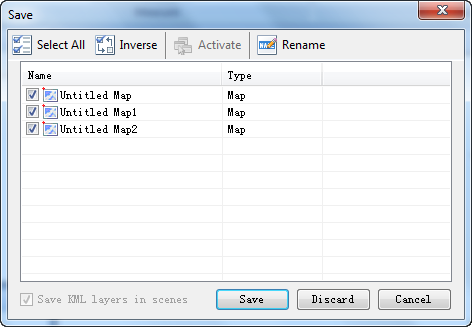

Closing All Windows

Close all open windows, including map windows, scene windows, layout windows
and attribute windows

### Basic Steps

  1. On the View tab, in the Windows group, click Close All. 
  2. The Save dialog box pops up to ask you whether you want to save the changes to the maps, scenes, or layouts.    
---  
  
"Save" dialog box

All unsaved items are listed in the Save dialog box. A checked box indicates
all changes to the item will be saved, while an unchecked box indicates that
all changes will be dropped.

The Rename command allows you to change the name of the map, layout, or scene.

The Select All and Inverse buttons are respectively used to select all items
and the inverse items in the list.

  3. Click Save to save the specified contents and close the dialog box.

### Note

After saving the maps, scenes, and layouts to the workspace, you still need to
save the workspace if you want to keep the changes for future use.

