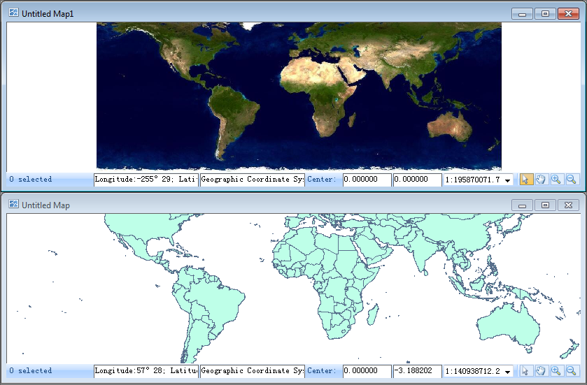
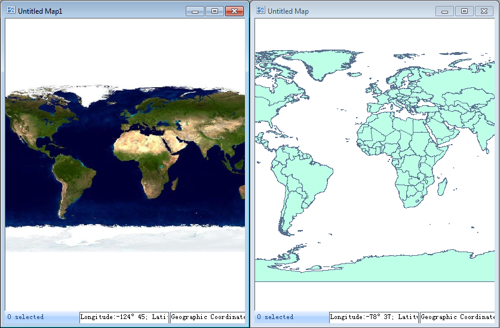

If the [window mode](WindowsModel.htm) is set to Cascade, there will be three
ways for arranging the windows: Tile Vertically, Tile Horizontally, and
Cascade.    
---  
Figure: Tile Horizontally  
  
---  
Figure: Tile Vertically  
  
---  
Figure: Cascade  
  
### Instructions

The Tile Horizontal, Tile Vertical and Cascade buttons in the Windows group
are only active if you choose to arrange the windows in
[Cascade](WindowsModel.htm) mode.

Click either Tile Vertically, Tile Horizontally, or Cascade to arrange windows
in the corresponding mode.

### Related Topics

[Window Modes](WindowsModel_Basic.htm)

[Switching between Window
Modes](WindowsModel.htm)

