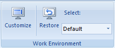

Available work environments are stored in the WorkEnvironment folder under the
installation directory of the application program. The configuration files
compose each work environment are gathered in the folder corresponding to the
work environments. When the application program is launched, the default work
environment corresponding to the Default folder under WorkEnvironment folder
is loaded.

You can use commands in the Custom group on the View tab to customize, switch,
and restore the work environment.    
---  
Figure: Managing work environments  
  
### Opening the Customize Window

Click on "Work Environment Design" in the drop-down list which is shown by
clicking Environment Design in Custom group under the View tab to customize
and extend current work environment.

To know how to customize and extent a work environment, please refer to [Work
Environment Design](../../UserCustom/UserCustom).

### Switching the Work Environment

You are allowed to switch between work environments through the Select drop-
down list in the Custom group on the View tab. All work environments stored in
the WorkEnvironment folder are listed for you to choose from.

### Restoring the Default Work Environment

Through the Restore button in the drop-down list shown by clicking
"Environment Design" in the Custom group under the View tab, you can restore
the default work environment.

### Related Topics

[Work Environment
Design](../../UserCustom/UserCustom)

