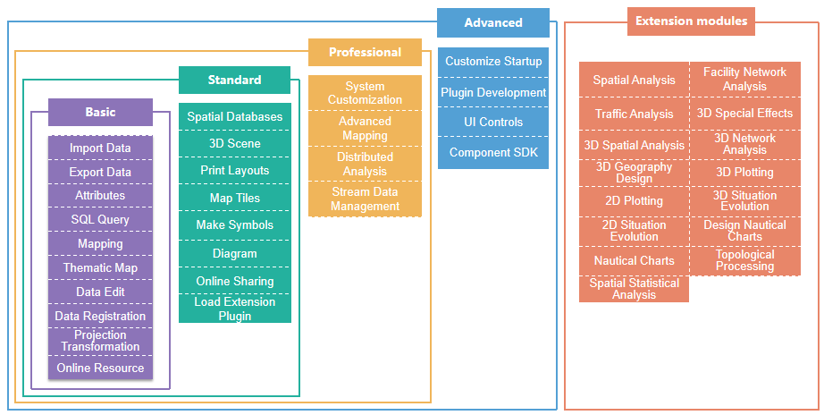

SuperMap iDesktop is a plugin GIS application constructed by SuperMap iObjects .NET, desktop core library and .NET Framework 4.0. If you want to use , you must have a SuperMap license. To meet different kinds of requirements from users, we provide four versions of . Following contents detail all features included in each version.

  * ** Basic Version**: Supports the spatial data engine SDX+ to manage files. Abundant data management tools are provided like importing/exporting data, data-type conversions, data browse and edit, etc.. Various data processing tools are introduced including data registration, projection transformation and so on. At the same time, lots of tools for creating maps and thematic maps are served. 

A basic version contains 10 modules: Import Data, Export Data, Attributes, SQL
Query, Mapping, Thematic Maps, Data Registration, Projection Transformation,
Data Edit and online resource.

  * ** Standard Version**: Based on the basic version, the spatial data engine SDX+ can manage spatial databases. 3D scenes, 3D effect display, oblique photography and BIM model are introduced. Designing and printing layouts are provided. The version allows you to customize symbols as your needs and generate map tiles. With this version, you can check online resources and share date online. You can create diagrams from attribute data conveniently. Besides, you are allowed to load extension plugins. 

A standard version contains all modules provided in a basic version, and adds
more modules: Spatial Databases, 3D Scene, Print Layouts, Make Symbols, Map
Tiles, Online Sharing, Diagram, and Load Extension Plugins.

  * ** Professional Version**: Based on the standard version, this version builds in the system customization, advanced mapping, distributed analysis, and stream data management. 

A professional version includes all modules provided in a standard version,
and add a series of new modules: System Customization, Advanced Mapping,
Distributed Analysis, and Stream Data Management.

  * ** Advanced Version**: The version is an Ultimate GIS product which includes all modules provided in an advanced version, meanwhile, supports customizing the startup and product name, provides pluggable development frame, rich UI controls and tool interfaces, and builds in the iObjects development package. 

An advanced version contains all modules served in a professional version, and
add some new modules: Customize Startup, Plugin Development, UI Controls, and
Component SDK.

  * **Extension modules**: All extension modules can be purchased singly. But first, you have to purchase any one of a standard version, a professional version and an advanced version. If you have purchased an advanced version, you don't need to purchase the four modules. Note: A basic version has no support to load an extension module.

  

  
## A comparison table between licenses and modules

The following table lists all features relative to licenses.

<table class="cmTable" border="1" cellspacing="0"  width="85%"  >
<thead>
  <tr>
    <td width="10%">
Feature modules
</td>
    <td width="40%">
Introduces
</td>
	<td width="5%">
Basic version
</td> 
	<td width="5%">
Standard version
</td> 
	<td width="5%">
Professional version
</td>
	<td width="5%">
Advanced version
</td> 
	<td width="15%">
Note
</td> 
</tr>
</thead>

<tr>
	<td>
Import Data
</td>
	<td>Imports kinds of data formats like vector, raster, model, etc. Supportive data types contain: AutoCAD, ArcGIS, image raster, 3D model data, Lidar, Google, vector files, GeoJson, SimpleJson, GJB, teledata, and so on.</td>
	<td>
v
</td>
	<td>
v
</td>
	<td>
v
</td>
	<td>
v
</td>
	<td>
--
</td>
</tr>

<tr>
	<td>
Export Data
</td>
	<td>Exports kinds of data formats like vector, raster, model, etc.Supportive data types contain: GeoJson, VCT, TIFF, ArcGIS Grid, teledata, TIN, and so on. </td>
	<td>
v
</td>
	<td>
v
</td>
	<td>
v
</td>
	<td>
v
</td>
	<td>
--
</td>
</tr>
<tr>
	<td>
Attributes
</td>
	<td>All features of operating and processing attribute tables are provided including creating, editing, browsing, outputting and counting attribute tables and so on.</td>
	<td>
v
</td>
	<td>
v
</td>
	<td>
v
</td>
	<td>
v
</td>
	<td>
--
</td>
</tr>
<tr>
	<td>
SQL Query
</td>
	<td>Searches data by SQL expressions.</td>
	<td>
v
</td>
	<td>
v
</td>
	<td>
v
</td>
	<td>
v
</td>
	<td>
--
</td>
</tr>

<tr>
	<td>
Mapping
</td>
	<td>Displaying, rendering, editing, generating maps.</td>
	<td>
v
</td>
	<td>
v
</td>
	<td>
v
</td>
	<td>
v
</td>
	<td>
--
</td>
</tr>

<tr>
	<td>
Thematic Maps
</td>
	<td>Powerful capabilities of creating thematic maps are provided. The thematic maps include: label thematic maps, unique thematic maps, diagrams, range thematic maps, dot density thematic maps, heat maps and grid aggregation maps, etc..</td>
	<td>
v
</td>
	<td>
v
</td>
	<td>
v
</td>
	<td>
v
</td>
	<td>
--
</td>
</tr>
<tr>
	<td>
Data Edit
</td>
	<td>Provides comprehensive features of editing data, abundant data processing features and supports for creating spatial indexes and field indexes.</td>
	<td>
v
</td>
	<td>
v
</td>
	<td>
v
</td>
	<td>
v
</td>
	<td>
--
</td>
</tr><tr>
	<td>
Data Registration
</td>
	<td>Quickly register and 3D register.</td>
	<td>
v
</td>
	<td>
v
</td>
	<td>
v
</td>
	<td>
v
</td>
	<td>
--
</td>
</tr>
<tr>
	<td>
Projection Transformation
</td>
	<td>Coordinate system settings and projection transformation (including coordinate point transformation, dataset transformation, batch projection transformation, four-parameters transgormation, and so on).</td>
	<td>
v
</td>
	<td>
v
</td>
	<td>
v
</td>
	<td>
v
</td>
	<td>
--
</td>
</tr>

<tr>
	<td>
Online Resource
</td>
	<td>Retrieve, browse, and use maps, data, symbol libraries, color tapes, custom resources, etc. online.</td>
	<td>
v
</td>
	<td>
v
</td>
	<td>
v
</td>
	<td>
v
</td>
	<td>
--
</td>
</tr>
<tr>
	<td>
Spatial Databases
</td>
	<td>Supports the spatial data engine SDX+ to manage databases. Kinds of databases are supported like OraclePlus, OracleSpatial, SQLPlus, MySQL, DM, Kingbase, HighgoDB, BeyonDB, and so on.</td>
	<td>
x
</td>
	<td>
v
</td>
	<td>
v
</td>
	<td>
v
</td>
	<td>
--
</td>
</tr>
<tr>
	<td>
3D Scene
</td>
	<td>Provides the browse, edit of 3D data and achieves the integration display and operations of 2D and 3D data.</td>
	<td>
x
</td>
	<td>
v
</td>
	<td>
v
</td>
	<td>
v
</td>
	<td>
--
</td>
</tr>
<tr>
	<td>
Print Layouts
</td>
	<td>Provides features of creating, designing and printing layouts. </td>
	<td>
x
</td>
	<td>
v
</td>
	<td>
v
</td>
	<td>
v
</td>
	<td>
--
</td>
</tr>
<tr>
	<td>
Make Symbols
</td>
	<td>Provides the feature of managing, creating and editing symbols. </td>
	<td>
x
</td>
	<td>
v
</td>
	<td>
v
</td>
	<td>
v
</td>
	<td>
--
</td>
</tr>
<tr>
	<td>
Map Tiles
</td>
	<td>Generates raster tiles or vector tiles in a single task and supports for updating, appending, resuming, restoring, and publishing tiles.</td>
	<td>
x
</td>
	<td>
v
</td>
	<td>
v
</td>
	<td>
v
</td>
	<td>
--
</td>
</tr>
<tr>
	<td>
Diagrams
</td>
	<td>Provides rich visualization tools. Quickly analyzing data based on attribute tables, conveniently mining data and saving results. Can interact with maps.</td>
	<td>
x
</td>
	<td>
v
</td>
	<td>
v
</td>
	<td>
v
</td>
	<td>
--
</td>
</tr>
<tr>
	<td>
Online Sharing
</td>
	<td>Supports for docking public cloud Online, private cloud iPortal and iServer to publish iServer services quickly. Can retrieve and share maps, data, symbol libraries, color schemes and custom resources online. Allows to browse and use online servers. </td>
	<td>
x
</td>
	<td>
v
</td>
	<td>
v
</td>
	<td>
v
</td>
	<td>
--
</td>
</tr>
<tr>
	<td>
Load Extension Plugin
</td>
	<td>The plugin manager allows to load extension modules</td>
	<td>
x
</td>
	<td>
v
</td>
	<td>
v
</td>
	<td>
v
</td>
	<td>
--
</td>
</tr>
<!--tr>
	<td>
Manage versions
</td>
	<td>Managing data versions, and you can back to an older version.</td>
	<td>
x
</td>
	<td>
v
</td>
	<td>
v
</td>
	<td>
v
</td>
	<td>The current version has no support to the module.</td>
</tr>
<tr>
	<td>
Python scripts
</td>
	<td>Builds in Python window. Allows users to call related interfaces to perform corresponding features by Python scripts. The module has an integration of data processing features including: import/export dataset, overlay analysis, create Thiessen polygons, construct polygons in topology, density cluster and so on. The toolbox supports Python light-level development and allows users to add developed features into a visual model for usages.</td>
	<td>
x
</td>
	<td>
v
</td>
	<td>
v
</td>
	<td>
v
</td>
	<td>The current version has no support to the module.</td>
</tr>
	<td>
Map Dashboard
</td>
	<td>This module can show data information intuitively through adding related controls. Data can be local or saved in a database. A dashboard can access maps in two or three dimensions, diagrams, videos, pictures, and so on. Controls can associate with each other to present more useful information. You are alowed to customize your own controls to enrich your dashboard. </td>
	<td>
x
</td>
	<td>
v
</td>
	<td>
v
</td>
	<td>
v
</td>
	<td>This module will be provided in future.</td>
</tr-->

<tr>
	<td>
System Customization
</td>
	<td>Visual system features and interface customization are provided to customize iDesktop GIS system. </td>
	<td>
x
</td>
	<td>
x
</td>
	<td>
v
</td>
	<td>
v
</td>
	<td>
--
</td>
</tr>
<tr>
	<td>
Advanced Mapping
</td>
	<td>Provides highly effective mapping functions including DLG data auto-mapping and scales mapping, vectorizing functions, multiprocess tile generation, tile checking, and services release to iServer.</td>
	<td>
x
</td>
	<td>
x
</td>
	<td>
v
</td>
	<td>
v
</td>
	<td>
--
</td>
</tr>
<!--tr>
	<td>
AR map
</td>
	<td>Provides the abilty to create map based on a video</td>
	<td>
x
</td>
	<td>
x
</td>
	<td>
v
</td>
	<td>
v
</td>
	<td>
--
</td>
</tr-->
<tr>
	<td>
Distributed Analysis
</td>
	<td>Provides strong abilities to analyze distributed data.</td>
	<td>
x
</td>
	<td>
x
</td>
	<td>
v
</td>
	<td>
v
</td>
	<td>
--
</td>
</tr>
<tr>
	<td>
Stream Data Management
</td>
	<td>Accesses vector data and video data instantly. A varieties of features about saving, analyzing, recalling, and so on are served.</td>
	<td>
x
</td>
	<td>
x
</td>
	<td>
v
</td>
	<td>
v
</td>
	<td>
--
</td>
</tr>

<tr>
	<td>
Customize Startup
</td>
	<td>Supports customizing the startup and name of the product.</td>
	<td>
x
</td>
	<td>
x
</td>
	<td>
x
</td>
	<td>
v
</td>
	<td>
--
</td>
</tr>
<tr>
	<td>
Extension Development
</td>
	<td>Provides pluggable development frame.</td>
	<td>
x
</td>
	<td>
x
</td>
	<td>
x
</td>
	<td>
v
</td>
	<td>
--
</td>
</tr>
<tr>
	<td>
UI Controls
</td>
	<td>A lot of UI controls and tool interfaces are provided.</td>
	<td>
x
</td>
	<td>
x
</td>
	<td>
x
</td>
	<td>
v
</td>
	<td>
--
</td>
</tr>
<tr>
	<td>
Component SDK
</td>
	<td>Provides component SDK.</td>
	<td>
x
</td>
	<td>
x
</td>
	<td>
x
</td>
	<td>
v
</td>
	<td>
--
 </td>
</tr>

</table>  

<table class="cmTable" border="1" cellspacing="0"  width="85%" bordercolor="#999999" >
<thead>
  <tr>
    <td width="10%">
Feature modules
</td>
    <td width="40%">
Descriptions
</td>
	<td width="20%">
License
</td>
	<td width="15%">
Note
</td> 

</tr>
</thead>
<!--tr>
	<td>
System Customization
</td>
	<td>The same with it in a professional version.</td>
	<td><strong>Professional version</strong> or above version or the system customization module license.</td>
	<td>
--
</td>
</tr>

<tr>
	<td>
Advanced Mapping
</td>
	<td>The same with it in a professional version.</td>
	<td><strong>Professional version</strong> or above version or the advanced mapping module license.</td>
	<td>
--
</td>
	</tr>
<tr>
	<td>
Diagrams
</td>
	<td>The same with it in a professional version.</td>
	<td><strong>Professional version</strong> or above version or the diagrams module license.</td>
	<td>
--
</td>
</tr>

<tr>
	<td>
Online Sharing
</td>
	<td>The same with it in a professional version.</td>
	<td><strong>Professional version</strong> or above version or the share online module license.</td>
	<td>
--
</td>
</tr>
tr>
	<td>
AR map
</td>
	<td>The same with it in a professional version.</td>
	<td><strong>Professional version</strong> or above or the AR map module</td>
	<td>
--
</td>
</tr-->

<tr>
	<td>
Spatial Analysis
</td>
	<td>Provides various features for vector data processing like overlay analysis, buffer analysis, attribute update, and so on. Provides abundant features for raster data processing like interpolation analysis, hydrology analysis, distance raster, etc.</td>
	<td>The spatial analysis module license</td>
	<td>
--
</td>
</tr>

<tr>
	<td>
Facility Network Analysis
</td>
	<td>Including: Single/Multiple tracing elements analysis, Adjacent element analysis, Critical element analysis, Connectivity analysis, Connected element analysis and checking loops and so on.</td>
	<td>The facility network analysis module license</td>
	<td>
--
</td>
</tr>

<tr>
	<td>
Traffic Analysis
</td>
	<td>Provides network analysis features like Location-Allocation analysis, TSP analysis, Logistics and distribution, Optimal path analysis, Find closest facility. Provides the capabilities of dynamical positioning, road planning and navigation.Supports indoor navigation.  </td>
	<td>The traffic analysis module license</td>
	<td>
--
</td>
</tr>

<tr>
	<td>
3D Spatial Analysis
</td>
	<td>Provides a series of 3D analysis features like intervisibility, terrain matching and so on.</td>
	<td>The 3D spatial analysis module license</td>
	<td>
--
</td>
</tr>

<tr>
	<td>
3D Special Effects
</td>
	<td>Provides various 3D special effects.</td>
	<td>The 3D special-effects module license</td>
	<td>
--
</td>
</tr>

<tr>
	<td>
3D Network Analysis
</td>
	<td>Provides a veriey of 3D network analysis features like 3D facility analysis, 3D modelling, 3D traffic network analysis, etc.</td>
	<td>The 3D network analysis module license</td>
	<td>
--
</td>
</tr>

<tr>
	<td>
2D Plotting
</td>
	<td>Providing 2D plotting and 2D plotting symbol libraries</td>
	<td>2D plotting module license</td>
	<td>
--
</td>
</tr>
<tr>
	<td>
3D Plotting
</td>
	<td>Providing 3D plotting and 3D plotting symbol libraries</td>
	<td>3D plotting module license</td>
	<td>
--
</td>
</tr>

<tr>
	<td>
2D Situation Evolution
</td>
	<td>Providing 2D situation evolution feature.</td>
	<td>2D situation evolution license</td>
	<td>
--
</td>
</tr>

<tr>
	<td>
3D Situation Evolution
</td>
	<td>Providing 3D situation evolution feature.</td>
	<td>3D situation evolution license</td>
	<td>
--
</td>
</tr>
<tr>
	<td>
3D Geographic Design
</td>
	<td>Provides methods for constructing, calculating, and processing data such as tilt photography models, TIN topography, geological bodies, and BIM.</td>
	<td>3D Geographic Design License</td>
	<td>
--
</td>
</tr>

<tr>
	<td>
Nautical Charts
</td>
	<td>Provides the capabilities of importing/exporting chart 000 data, browsing chart data, viewing object information, editing attibutes of chart objects and setting display efficiency and so on.</td>
	<td>The nautical chart module license</td>
	<td>
--
</td>
</tr>

<tr>
	<td>
Design Nautical Charts
</td>
	<td>Based on the S-52 standard enacted by IHO,  display electronical nautical charts. Importing, exporting, and producing nautical charts matching S-57 standard are served. Checking data according to S-58 standard is provided to ensure the validity of data spatial and descripton information thereby enhance producing quality.  </td>
	<td>The disigning nautical charts module license</td>
	<td>
--
</td>
</tr>

<tr>
	<td>
Spatial Statistic Analysis
</td>
	<td>Recognizes the spatial dependence, spatial correlation or spatial autocorrelation between data relative to geographical position by using statistic methods thereby establishes the statistic relation between data. </td>
	<td>The spatial statistic analysis module license</td>
	<td>
--
</td>
</tr>
<tr>
	<td>
Topological Processing
</td>
	<td>Provides the topological processing features including: Check Topology, Region By Topology, automatically repair topology errors, and maintain and manage topology relationships.</td>
	<td>The topological processing module license</td>
	<td>
--
</td>
</tr>
<!--tr>
	<td>
Distributed Analysis
</td>
	<td>Supports the storage and management of kinds of distributed data including HDFS, Hbase, iServer DataStore engines. Provides varieties of calculations and analyses based on online distributed data like: density analysis, overlay calculation, object query, spatial summarize and so on. </td>
	<td>The distributed analysis module license</td>
	<td>
--
</td>
</tr>

<tr>
	<td>
Indoor navigation
</td>
	<td>Includes abilities to associate 2D data with 3D data and show them. The module can compile navigation models and integrates route planning and navigation simulation, and so on.</td>
	<td>Indoor navigation module</td>
	<td>
--
</td>
</tr>
<tr>
	<td>
Machine learning
</td>
	<td>Machine learning module</td>
	<td>This module will be provided in future</td>
</tr-->
</table> 
  
**The supplementary instruction to extension modules and system
customization.**

  * **Extension Module** : you can purchase any extension modules separately. But to load an extension module, you need to purchase any one of a standard version, a professional version, and an advanced version.
  * **System customization** : For a standard version, you can buy the **System Customization** module. 

**Note** : If you need to call interfaces from SuperMap iObjects when developing plugins based on SuperMap iDesktop, you need corresponding SuperMap iObjects license. If you want to deploy the developed plugins on another machine, that machine needs the license **Load Extension Plugin** and the related SuperMap iObjects license.

The following table details the support of different versions to the features above.

Version | Extension Module | System Customization | 
---|---|---  
Basic version |x|x
Standard version | v | x  
Professional version | v | v  
Advanced version | v | v  
  

