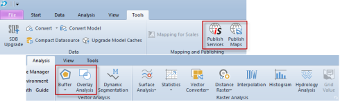
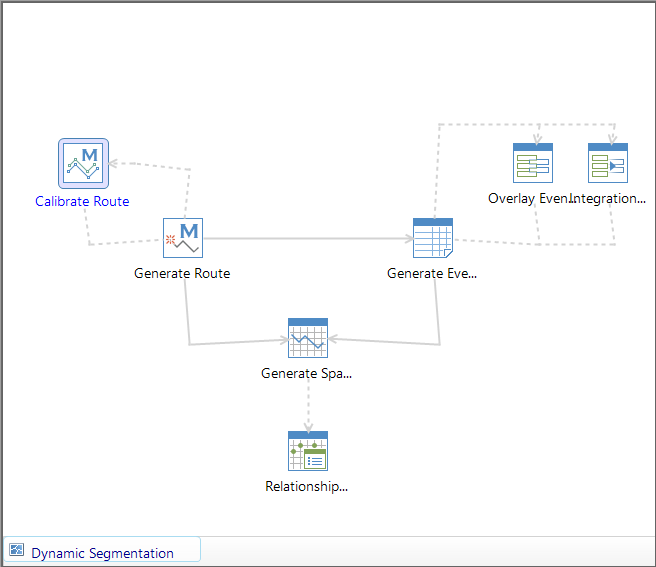
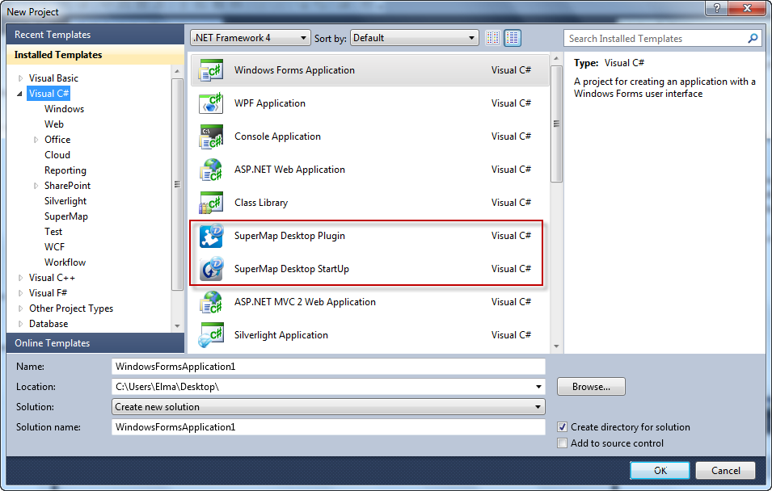
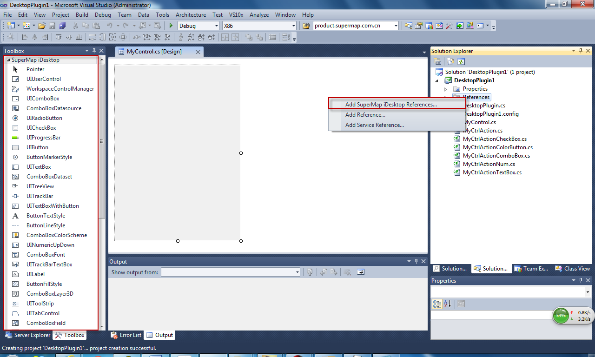
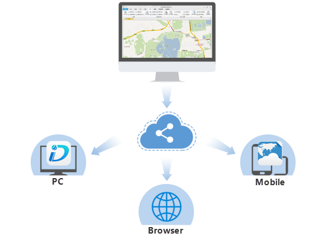
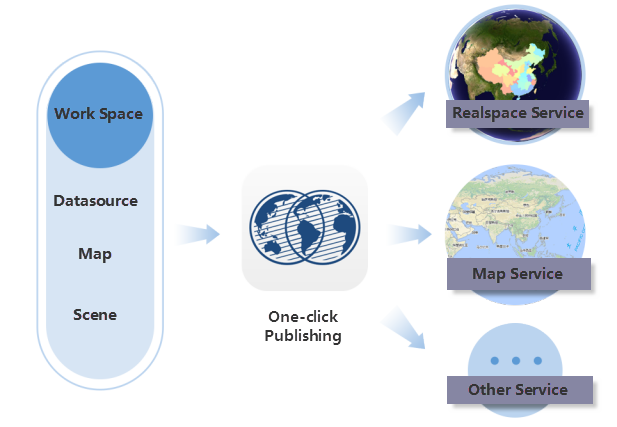
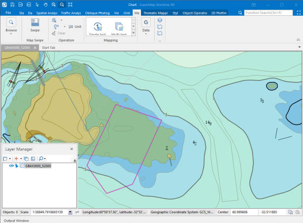

### Complete GIS Functions

Rich GIS functions such as data management of different formats, vector and
raster data processing, map and nautical chart editing, spatial analysis, 2D
and 3D mapping, data sharing on the cloud, extension development, etc. are
provided to satisfy needs of different groups of users.

### 2D and 3D Integration

2D and 3D integration includes data, display, query, analysis integration. The
integration can help users realize applying 2D data in 3D scene. Users are
allowed to create thematic maps, perform fast modeling, perform attribute
query, etc. for 2D data in the scene. Meanwhile, browsing, editing, analysis,
etc. for 3D data are also allowed.

 |   
---|---  
  
### Easy-to-use Functions

Ribbon interface style has been employed to group functions of different
classes on the tab for the convenience of users. Meanwhile, workflow for
hydrology analysis and dynamic segmentation analysis have been provided to
save learning cost for users and reduce error rate caused by incorrect
workflow.

 |   
---|---  
Ribbon style interface | Operation workflow  
  
### Extension Development

VS project templates and sample programs have been provided to allow users to
get started with extension development quickly. Meanwhile,  toolbox and quick
reference have been integrated into IDE to allows users to develop new
plugins, therefore satisfying the customization needs of users.

 |   
---|---  
  
### Cloud Sharing

iServer service publishing functions are provided. Users can publish local or
remote iServer services into different types of services, including REST
services, OCG services, etc.

 |   
---|---  
  
### Nautical Chart Modification

supports nautical chart storage, display and editing. IHO S-57, IHO S-52 and
IHO S-58 standards are supported. Moreover, nautical chart conversion,
display, query, editing, data checking, etc. are provided. Users can modify
based on an existing copy of nautical chart, or they can create a new copy of
nautical chart. Meanwhile, nautical chart data and land data integration is
supported to realize land and sea integration.

  
---  

