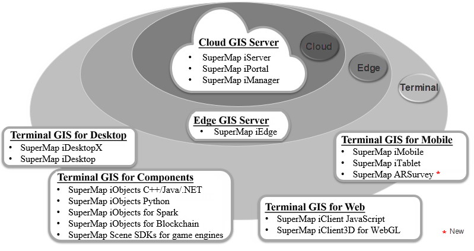

SuperMap GIS 10i includes cloud GIS server, edge GIS server, terminal GIS, and online GIS platform to fully embrace spatial big data.

  
---  
  
##  Cloud GIS server

### SuperMap iServer

Cloud GIS application server based on high-performance cross-platform GIS
core. It has abilities to manage, cluster and publish 2D&3D integration
services and multi-level extended development capabilities.

Provides strong Web services like saving and analyzing spatial big data,
instantly processing flow data, machine learning, and spatial data science.
Apart from these, it supports publishing a huge amount of data without
generating tiles.

Provides kinds of SDKs using in PC side, Web side, mobile side and fuses micro
services, container, etc. to build spatial big data, AI, and 3D GIS
application systems based on cloud-native architecture.

### SuperMap iPortal

A GIS portal platform combining GIS resource's integration, search, share and
management and it has abilities to customize visualization interfaces without
codes, register multi-source heterogeneous services and monitor dashboards by
system and so on.

It provides abundant web-side applications like creating thematic maps, 3D
visualization, distributed spatial analysis, showing data in big screen and
creating template applications and so on.

It is the user center, resource center and application center of cloud-end
integration GIS platform and can build GIS cloud portal stations quickly.

### SuperMap iManager

A comprehensive management software for GIS operation and maintenance which
can be used for managing application services, basic facilities and big data.
With the Kubernetes solution you can build big data, AI, and 3D GIS
application systems based on cloud-native architecture with one click.

It can monitor multiple GIS data storages, calculation and service nodes or
other Web stations, and hardware resource usage, map access hotspots, node
health status, etc.

It can manage GIS Native system thereby achieve dynamic scale and flexible
deployment to granularity.

##  Edge GIS server

### SuperMap iEdge

It is deployed close to client sides or datasources and achieves near-service
publishing and real-time analysis calculations thereby reduces response
latency and bandwidth consumption and then relieves stress of cloud GIS
center.

It can be taken as the edge node between the GIS cloud side and the
application side to improve the GIS-end access experience with the proxy
service aggregation and cache acceleration technology, and provides content
distribution and edge analysis and computing capabilities to help build a more
efficient and intelligent "Cloud-Edge-End" GIS application system.

## GIS in PC ends

### SuperMap iObjects Java

A large scale component-style GIS development platform that has abilities to
cross platform, integrate 2D and 3D data and process big data GIS and is
applicable to Java development environment.

### SuperMap iObjects C++

A large scale component-style GIS development platform that is applicable to
C++ development environment and provides abilities to cross platform,
integrate 2D and 3D data.

### SuperMap iObjects .NET

A large scale component-style GIS development platform that has abilities to
integrate 2D and 3D data and is applicable to Java development environment.

### SuperMap iObjects Python

A GIS script package that has the ability to organize, convert, process, and
analyze spatial data. It applies to Python development environment.

### SuperMap iObjects for Spark

Distribution-based big data GIS basic component that provides abundant
distributed abilities to manage and analyze big data. It applies to Spark-
architecture calculation and development environments.

###

A desktop-style GIS application and development software which has various
features like editing, managing and processing 2D&3D integrated data, mapping,
analyses, 2D/3D plotting and so on. It supports nautical charts, accessing
online maps and collaborative sharing of cloud-end resource and it can apply
to produce, process, analyze spatial data and customize business application
systems easily.

### SuperMap iDesktopX

It is a cross-platform full-featured desktop-style GIS software that supports
Windows and Linux operation systems.

Provides a series of features to produce, process, manage, analyze, and map
spatial data, publish services, create processing automation models, and so
on.

##  Web-side GIS

### SuperMap iClient JavaScript

A cloud-GIS network client development platform which is constructed based on
the modern Web technology stack and is a unified JavaScript client of SuperMap
cloud GIS and online GIS platform products.

Integrates the leading open source map development library and visual
development library, and the core code is completely open sourced under the
Apache License 2.0 protocol, connecting SuperMap and the open source
community.

Provides a new big data visualization function, and so rendering of maps can
be more beautiful and smooth in browsers or mobile terminals.

### SuperMap iClient3D for WebGL

A 3D client-side development platform which is developed based on the WebGL
technology and can be used for constructing no-plugin, cross-platform, cross-
browser 3D GIS application program.

##  Mobile GIS

### SuperMap iMobile for Android / iOS

A professional fully-featured mobile GIS SDK. It not only supports common data
formats, 2/3D application development, and online/offline applications, but
also provides multiple data visualization effects.

### SuperMap iMobile Lite for Android / iOS

A lightweight mobile GIS SDK which is developed for online applications.

### SuperMap iTablet for Android / iOS

A fully-featured mobile GIS APP that is developed based on SuperMap iMobile.
It supports cartography, data collection by templates, data analysis, 3D data
display, indoor-outdoor integration navigation, target detection, custom
development, and so on.

##  Online GIS platform

### SuperMap Online

The SuperMap online GIS platform (www.supermapol.com) helps people upload GIS
data to cloud safely and provides rich tools to display and analyze data
online and develop various SDKs to access GIS data thereby develop business
systems quickly.

