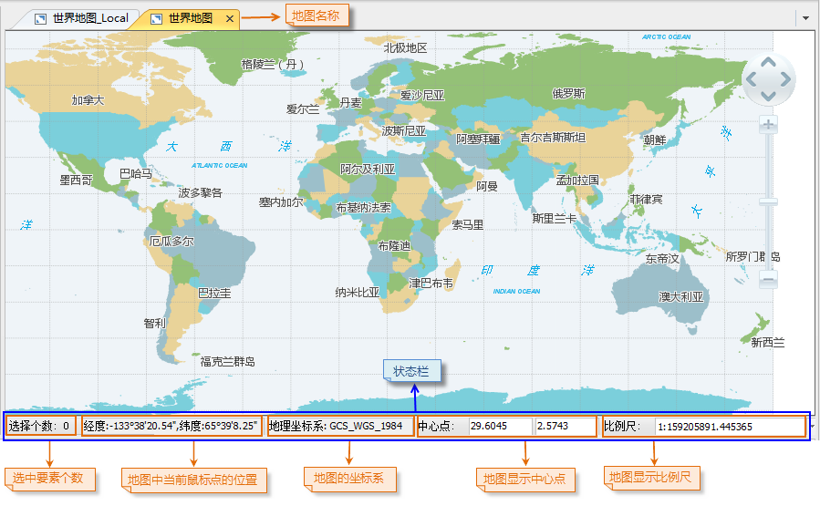
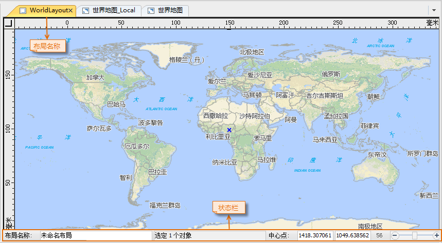
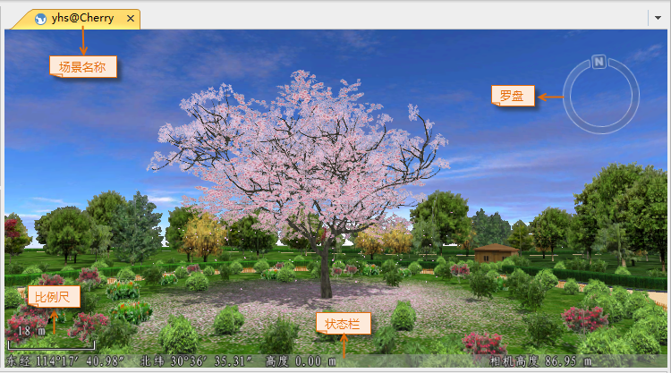
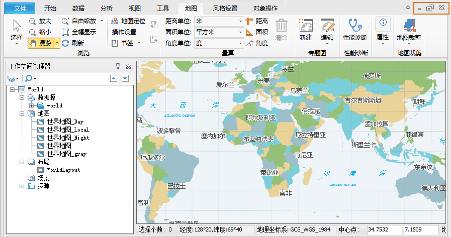
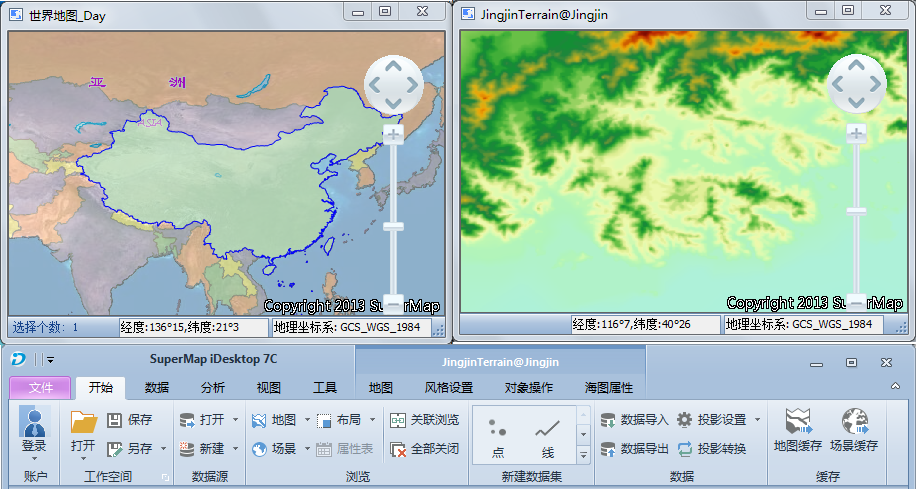

Child Windows

The windows of the application include the main window, floating window, map
window, the scene window, the layout window, the attribute table window, as
well as the dialog boxes, etc., where the map window, scene window, layout
window, attribute table window are the sub windows of the application.

### The Map Window

The map window is used to display, edit 2D spatial data. All datasets with
spatial information can be added to the map window for display and editing and
you can addd several datasets to a single map window at the same time.
Besides, you can perform spatial analysis in the map window.

  
---  
Figure: The map window  
  
The title of the map appears on the top of the map window. At the bottom is
the status bar, on which the position of the mouse pointer, the display
center, the coordinate system, the display scale, and the map browsing toolbar
are displayed.

  * The x and y coordinates of the display center are instantly displayed in the two text boxes to the right of Center and the values can be changed manually. To achieve this, you need to enter the x and y coordinates in the text boxes for the display center, and then press Enter.
  * When you pan the map, the coordinates of the display center in the two text boxes will be changed accordingly. When you type values in the two text boxes to specify the coordinates of the display center, the map will be panned until the specified point and the center of the map window coincide.

  * The display scale of the map is instantly displayed in the combo box to the right of the two text boxes for the display center coordinates. You can change the display scale manually by typing a value in the combo box, or selecting one from the drop-down list where commonly used scales are listed.
  * In the bottom right corner of the map window is the map browsing toolbar, on which the Select, Pan, Zoom In, Zoom Out and Full Extent commands are organized.

### The Layout Window

The layout is used for map layout. You can add map elements, such as the map,
scale, legend, north arrow, title, etc., to complete a map for export and
printing. Besides, you are permitted to edit the properties of those elements
in a layout window.

  
---  
Figure: The layout window  
  
### The Scene Window

The scene window is where the scene relies and the scene models the earth with
a 3D globe overlaid with world image. The scene models the earth with a globe
overlaid with world image. You can add 2D and 3D data to a scene for browsing
and some other basic operations. A scene also models the environment of the
earth, including the sky, the atmosphere, the fog, etc. Besides, you can
observe the globe from different perspectives through camera settings.

  
---  
Figure: The scene window  
  
  * The title of the scene appears on the top of the scene window.
  * At the bottom is the status bar, on which the longitude, latitude and altitude of the mouse pointer, and the altitude of the camera are displayed.
  * On the right of the map window is the navigator, with which you can zoom in, zoom out, pitch, and roll the scene.

### The Attribute Table Window

The attribute table window is used to display attribute information of the
dataset.

  
---  
Figure: The attribute table window  
  
  * The title of the attribute table appears on the top of the attribute table window.
  * At the bottom is the status bar, on which the operation field and the statistical results are displayed.

Label Mode

If arranged in cascade mode, all child windows are displayed independently.

On the title bar of each child window, there are three buttons: the Minimize
button , the Maximize button  and the Close
button .

When you maximize a child window, the title bar of the window will disappear
and the three buttons will be displayed on the Ribbon as shown in the figure
below. You can click the Restore button  to restore the
window arrangement.

  
---  
Figure: A map window  
  
---  
Figure: Minimized map window  
  
The Tile Horizontally, Tile Vertically, and Cascade commands in the
Ribbon>View>Window group allows you to arrange child windows in cascade mode.

  
---  
Figure: Tile Horizontally  
  
---  
Figure: Tile Vertically  
  
---  
Figure: Cascading Windows  
  
Extended Mode

This mode supports using a computer to display multiple windows at the same
time, where different windows can display different content. With the extended
mode, it can display more information. For example, in the main program
window, use an extension screen to modify, the result can be directly
displayed on the extension screen.

On **"View"** tab, in **"Windows"** group, click **"Extended"** to make
extended display. Each sub window is independent, which can be operated
separately. The operation mode is similar to the Cascade mode.

In the case of a monitor, the effect of the split screen display for the two
map windows is shown in the picture below.

  
---  
Figure: Extended Display  
  
The three buttons on the right are： Minimize，
Maximize， Close，which can be used to minimize, maximize
or close the window. In this mode, if the main program is maxmized, other
split windows will hide behind it.

Press the F11 key, you can enter the full screen mode. The current map window,
layout window or scene window will be displayed in full screen. Press Esc key
to exit the full screen mode.

