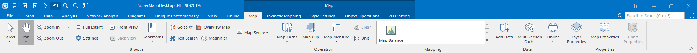
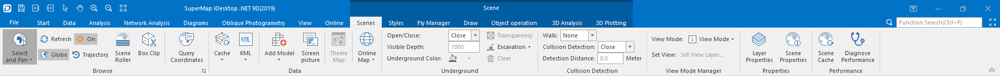
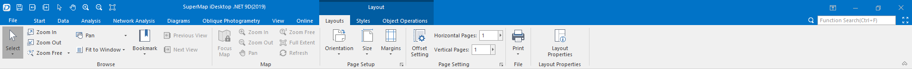
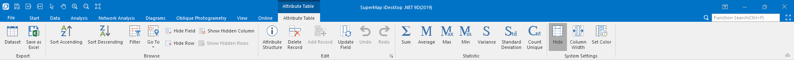

---
id: ContextTabsIntroduct
title: Context tab 
---  
Tabs

Tabs are bound to window forms and will only be displayed if the window form
binding with it is activated. For instance, tabs bound to the map window will
only be displayed on the Ribbon if the currently active window is a map
window.

In SuperMap iDesktop, there are tabs bound to the map window, scene window,
layout window, layout window and attribute table window.

### Tabs Bound to the Map Window

Tabs bound to the map window will only be displayed on the Ribbon if a map
window is activated. Tabs bound to the map window include: Maps, Styles,
Thematic Mapping, 2D Plotting, Object Operations.

  
---  
Figure: Tabs bound to the map window  
  
### Tabs Bound to the Scene Window

Tabs bound to the scene window will only be displayed on the Ribbon if a scene
window is activated. Tabs bound to the scene window include: Scenes, Styles,
Fly Manager, Draw and 3D Analysis.

  
---  
Figure: Tabs bound to the scene window  
  
### Tabs Bound to the Layout Window

Tabs bound to the layout window will only be displayed on the Ribbon if a
layout window is activated. Tabs bound to the layout window include: Layouts,
Styles and Object Operations.

  
---  
Figure: Tabs bound to the layout window  
  
### Tabs Bound to the Attribute Table Window

Tab bound to the attribute table window will only be displayed if an attribute
table window is activated. The tab bound to the attribute table window is
Attributes.

  
---  
Figure: Tabs bound to the attribute table window  
  
