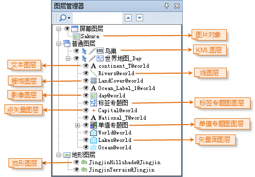

---
id: Layer3DManager
title:   
---  
Workspace Manager for Scenes

When the currently active window is a scene window, Layer Manager plays as a
tool for manageing all layers in the scene. Layers in a scene have three major
types: screen layer, general layer, and terrain layer.

### Introduction to different types of scene layers

  1. **Screen Layer**

Only one screen layer can be contained in a scene, but several image objects
can be added into the screen layer and all objects added to the screen layer
will be displayed on the globe in the scene. Since image objects in the screen
layer are placed on the screen at prescribed positions and are not
georeferenced to the scene coordinate system, they will remain stationary when
operations, such as rotate, tilt, zoom in, zoom out, etc., are performed on
the globe. Therefore, you can add what you want to display as static contents
into the screen layer. For instance, you may want to display a logo or some
descriptive information on the screen as static contents, then you can add
these contents in supported image formats into the screen layer.

A scene can only add one screen layer where you can add several image objects.

  2. **Terrain Layers**

Terrain data in .SCT format you add to a scene will be organized as terrain
layers under the Terrain Layers node in Layer Manager.

  3. **General Layer (3D layer)**

A general layer is also called a 3D layer. 2D data, including vector datasets,
grid datasets, and image dataset, image cache data, model cache data, and
KML/KMZ data added to a scene will be organized as 3D layers.

According to the type of data connected to a 3D layer, 3D layer types include:

    * dataset-based 3D layer, the type of a 3D layer generated from adding a 2D dataset to a scene.
    * vector layer, the type of a 3D layer generated from adding a 2D vector dtaset to a scene. Based on the type of the 2D vector dataset, a vector layer can be a point layer, a line layer, or a region layer.
    * image layer, the type of a 3D layer generated from adding a 2D image dataset to a scene.
    * grid layer, the type of a 3D layer generated from adding a 2D grid dataset to a scene.
    * model cache layer, the type of a 3D layer generated from adding model cache data in .SCV format to a scene.
    * image cache layer, the type of a 3D layer generated from adding image cache data either in .SCI3D or .SIT format to a scene.
    * KML Layer, the type of a 3D layer generated from adding KML data either in .KML or .KMZ format to a scene.

### Introduction to Layer Manager

When a new scene is opened in a scene window and no data has been maually
loaded, Layer Manager will be shown as below. You may notice there are three
parallel root nodes: Screen Layer, General Layers, and Terrain Layers, each of
which corresponds to a specific layer type. All data you add to the scene will
be organized under the three root nodes in Layer Manager.

  
---  
Figure: Layer Manager with no data added to the scene  
  
Layer Manager will be shown as below When you add data to a scene.

  * Each child node under the Screen Layer node corresponds to an image object in the scene.
  * Each child node udner the General Layers node corresponds to a 3D layer in the scene.
  * Each child node under the Terrain Layers corresponds to a terrain layer in the scene.

  
---  
Figure: Layer Manager with data added to the scene  
  
A context menu with a rich set of commands is provided for each node in Layer
Manager.

