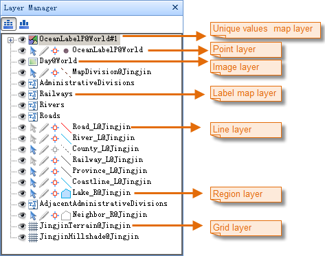
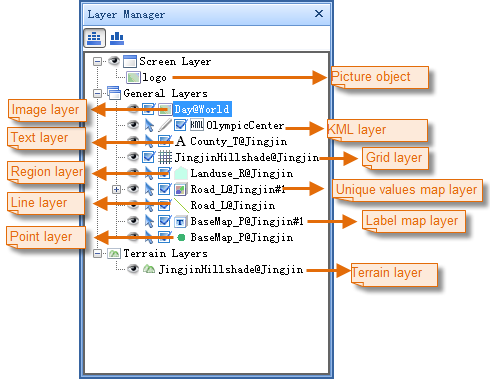

---
id: LayerManagerIntroduct
title:   
---  
Layer Manager

The Layer Manager is a dock bar used for managing layers in a map or scene.

Each layer in a map or scene has a corresponding node with the layer caption
displayed in the Layer Manager. You are allowed to control the status of a
layer with commands ahead of the layer node. The map layers and scene layers
are organized in different ways in the Layer Manager. The major difference is
that scene layers are organized in three groups: Screen Layer, General Layers,
and Terrain Layers. While map layers are organized in parallel.

If the currently active window is a map window, map layers are displayed
parallel in the Layer Manager. Scene layers are grouped and displayed in the
Layer Manager while the currently active window is a scene window.

 |   
---|---  
Figure: The Layer Manager for Maps | Figure: The Layer Manager for Scenes  
  
You are allowed to set visibility, selectability, editability, and
snappability for layers in Layer Manager. If you have set maximum or minimum
scale for a layer, line marks will display. Blue lines indicate the layer is
currently within visible scale range, red lines indicate the layer is out of
visible scale range. When the current scale of the layer is within the scale
range, the mark is ; when the scale of the current layer
is larger than the specified maximum scale, the mark is
; when the scale of the current layer is smaller than
the specified minimum scale, the mark is . If you only
set maximum or minimum scale for the layer, only top line or bottom line will
display correspondingly.

The Layer Managers for maps and scenes are introduced in detail below.

[Layer Manager for Maps](Layer2DManager.htm)

[Layer Manager for Scenes](Layer3DManager.htm)

