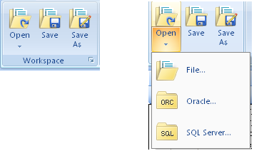
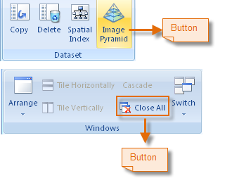
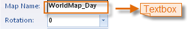
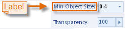
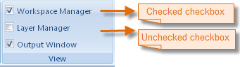
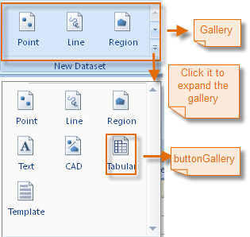
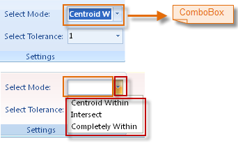
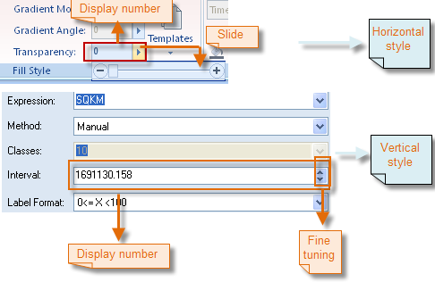

---
id: RibbonControlsIntroduct
title: Ribbon Controls 
---  

On the Ribbon are different types of Ribbon controls arranged on the task-
oriented tabs. The Ribbon controls are introduced in detail below.

### ButtonDropDown

The Ribbon buttonDropDown control appears in two parts: the image part and the
text part with a drop-down arrow. The user can click the image to directly
implement the corresponding action, or the text to select a specific command
from list.

  
---  
Figure: ButtonDropDown  
  
### Button

The Ribbon button control allows the user to click it to perform an action.
The button control can display text, image, or both. When the button is
clicked, it looks as if it is being pushed in and released.

  
---  
Figure: Button  
  
### TextBox

The Ribbon textBox control can be editable or non-editable. The purpose of
editable texboxes is to allow the user to input text information to be used by
the program, and non-editable textBoxes can serve the purpose of simply
displaying text.

  
---  
Figure: TextBox  
  
### Label

The Ribbon label control is used to display text that cannot be edited by the
user.

  
---  
Figure: Label  
  
### CheckBox

The Ribbon checkBox control indicates whether a particular condition is on or
off. It is commonly used to present a Yes/No or True/False selection to the
user.

  
---  
Figure: CheckBox  
  
### ButtonGallery

A buttonGallery can only be placed in a gallery and is very similar to a
button. The user can click a buttonGallery to implement the action bound to
it.

  
---  
Figure: ButtonGallery  
  
### ComboBox

The Ribbon comboBox control is used to display data in a drop-down combo box.
The comboBox control appears in two parts: the top part is a text box that
allows the user to type a list item. The second part is a list box that
displays a list of items from which the user can select one.

  
---  
Figure: ComboBox  
  
### ColorButton

On the button displays the currently selected color. The user can change the
color by clicking the drop-down arrow and selecting a color from the color
panel that appears. To access more colors, the user can click Color Library...
on the color panel.

  
---  
Figure: ColorButton  
  
### IntegerUpDown

The Ribbon integerUpDown control looks like a combination of a text box and an
arrow that the user can click to display a slide bar, vertical or horizontal,
for value adjustment. The control displays and sets an integer value from a
list of choices. The user can increase and decrease the number by typing a
number, or by moving the slide bar that shows up when clicking the arrow.

  
---  
Figure: IntegerUpDown  
  
