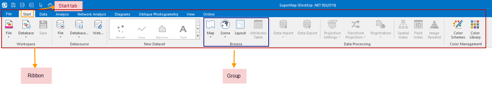

SuperMap Deskpro .NET employs the Ribbon-style interface. With the Ribbon, no
longer do you have to wander through the maze of menus, submenus and toolbars
searching for what you want. On the Ribbon are all the commands you need
arranged on the task-oriented tabs.

For the Ribbon-style user interface, each command has a Ribbon control
corresponding to it. Ribbon controls are controls that can be placed on the
Ribbon, including buttons, buttonDropDowns, textBoxes, comboBoxes, etc. In the
red rectangle in the figure below shows the Ribbon, where all controls are
organized.

Tabs and groups are employed to better organize the Ribbon controls. The
Ribbon controls are firstly assigned to different tabs according to their
targets or solutions they are related to, and then they are grouped based on
their functions.

  
---  
Figure: The Ribbon  
  
**Figure Descriptions:**

  * In the orange rectangular box shows the Ribbon, where ribbon controls are organized. 
  * In the red region is the currently selected tab, the Start tab. The commands organized on a tab are displayed on the Ribbon when the tab is selected.
  * On the top of the Ribbon shows tab titles, such as Start, Data, View, etc. You can click a tab title to display the corresponding tab page. 
  * In the right blue rectangular box is a group, the Datasource group. The name of a group, displayed at the bottom of the group area, indicates the functions of the commands organized in the group. For example, the Datasource group organizes commands related to datasource operations. 
  * Certain groups may have dialog boxes bound to them. A small group dialog box button will show up in the bottom right corner of the group area if there is a dialog box is bound to the group. 

