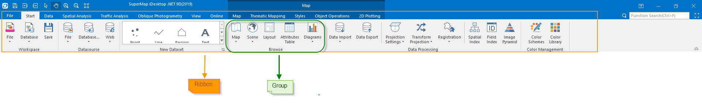

After starting , the main interface will be shown. The interface adopts the
style of Microsoft Office 2016 (eg. Ribbon style) which replaces traditional
mode of organizing each function and command with menus and tool bars.

Parts in the main interface of the application include:

  * File button: Located on the upper left corner of the main window. A set of commonly used commands is organized on the File menu. Besides, the recently opened datasources and workspaces are listed on the File menu.
  * Ribbon: Provides a clear and direct way to organize commands.
  * Quick Access Toolbar: The commonly used features are organized at the left-top corner of the interface including: Save, browse tools, open installation directory of iDesktop and Help Document, etc. 
  * Workspace Manager: A dock bar for workspace management. The Workspace Manager employs the tree structure to organize the workspace and the data.
  * Layer Manager: A dock bar used to manage layers in map windows or scene windows.
  * Output Window: A dock bar used to display messages generated during operations.
  * Work Area: Used to display windows such as map window, layout windows, scene windows, attribute tables, and other dock bars. 
  * Status Bar of Map Window: It is used to display the scale of the map in real time, the coordinate values (X, Y and latitude and longitude), the coordinate system name and the coordinates of the center point of the map window. You can copy, paste, edit the scale, coordinate value, coordinate system name and the center point.

### Ribbon Introduction

The ribbon-style interface replaces the conventional way of organizing
commands by menus, submenus and toolbars. The advantages of the ribbon-style
interface lie in:

  * More intuitive commands distribution: The commands are well organized through tabs and groups.
  * Much easier to find a command: To access a command, you only need to activate the corresponding tab.

  
---  
Figure: Ribbon Structure  
  
  * In the orange rectangular box shows the Ribbon, where ribbon controls are organized. 
  * On the top of the Ribbon shows tab titles, such as Start, Data, View, etc. You can click a tab title to display the corresponding tab page. 
  * In the orange rectangular box is a group, the Datasource group. The name of a group, displayed at the bottom of the group area, indicates the functions of the commands organized in the group. For example, the Datasource group organizes commands related to datasource operations. 
  * Certain groups may have dialog boxes bound to them. A small group dialog box button will show up in the bottom right corner of the group area if there is a dialog box is bound to the group. 

The main interface consists of following parts:

[File Menu](../StartMenu/StartMenu.htm)

[Ribbon](RibbonIntroduct.htm)

[Tabs](ContextTabsIntroduct.htm)

[Ribbon Controls](RibbonControlsIntroduct.htm)

[Child Windows](ChildWindows.htm)

[Dock Bars](FloatWindows.htm)

[Workspace Manager](WorkspaceManager.htm)

[Layer Manager](LayerManagerIntroduct.htm)

[Output Window](OutputWindows.htm)

[Process Management Window](proceduremanage.htm)

