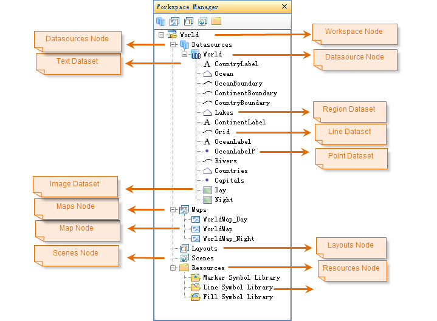
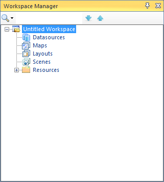

---
id: WorkspaceManager
title:   
---  
Workspace Manger

As a visual workspace management tool, Workspace Manager organizes data in a
tree structure, consistent with the structure of data stored in a workspace. A
workspace contains a datasource set, a map set, a layout set, a scene set and
a symbol library set. When opened in Workspace Manager, the original structure
of the workspace will be maintained. In the Workspace Manager tree, the root
node of the opened workspace has the following child nodes:

  * Display/Hide node: You are allowed to display or hide nodes for datasources, maps, layouts, scenes, resources, etc. All nodes display by default. 
  * Toolbar: Workspace Manager supports to locate, which is convenient for users to locate the nodes in the tree nodes. It supports to search datasets, datasources, maps, layouts and scenes. When there are many results that meet the conditions, you can use the subscript button to locate to the different matches.
  * Datasources, a node corresponding to the datasource set in the workspace. All opened datasources in the workspace are listed as child nodes of the Datasources node. A datasouce and its corresponding node share the same name.
  * Maps, a node corresponding to the map set in the workspace. All maps stored in the workspace are listed as child nodes of the Maps node. A map and its corresponding node share the same name.
  * Layouts, a node corresponding to the layout set in the workspace. All layouts stored in the workspace are listed as child nodes of the Layouts node. A layout and its corresponding node share the same name.
  * Scenes, a node corresponding to the scene set in the workspace. All scenes stroed in the workspace are listed as child nodes of the Scenes node. A scene and its corresponding node share the same name.
  * Symbol Libraries, a node corresponding to the symbol library set in the workspace. The Symbol Libraries node has three child nodes: Marker Symbol Library, Line Symbol Library, and Fill Symbol Library.

Only one workspace can be opened at a time and the currently opened workspace
is manipulated in Workspace Manager.

  
---  
Figure: Worksapce Manager tree with an opened workspace  
  
When the application prgram is launched without an open workspace, an empty
workspace with the default name Untitled Workspace will be opened by default.
Below shows the Workspace Manager tree when an empty workspace is opened. You
may notice that except the Symbol Liraries node, none of the Dataresouces
node, Maps node, Layouts node, and Scenes node contains any child nodes.

  
---  
Figure: Worksapce Manager tree with an empty workspace  
  
Besides, the toolbar in Workspace Manger provides you with tools to control
the nodes in the Workspace Manager tree.

