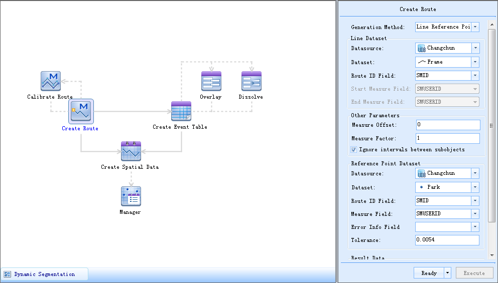

SuperMap GIS 9D(2019) Desktop provides a new function management mechanism-
workflow management, which automatically executes multiple processes according
to the workflow's order for a series of process-oriented functions. Its aim is
to help users quickly execute the workflow customized by themselves. Users who
don't have the GIS background knowledge also can easily use it.

Now, the dynamic segmentation and hydrology analysis modules adopt the
workflow management method to organize the related functions. Please refer to
[Dynamic Segmentation](../DynamicSeg/DynamicS.htm) and [Hydrology
Analysis](../Hydrology/HydrologyAnalyst.htm) for more information.

### Advantages of Workflow Management

  * Visualization: Combines all the functions of the entire analysis module by a workflow. It is displayed by a graph, so it is user-friendly.
  * Easy to use and flexible operation: The parameter settings are quite simple. Not only can it execute a single function, it can also flexibly customize multiple processes to execute. 
  * Automatic Workflow: Customizes a series of functions according to the actual demand and executes the workflow according to the customized order.

### Introduction to Workflow Manager Window

The **Workflow Manager** window is composed of two parts. As shown in the
figure below, the left zone (Ribbon) is used to display all the processes of
the current analysis module and their relationships; the right zone (Parameter
Settings Zone) is used to set parameters. If you select a process (click to
select the corresponding button), the window on the right side will be
automatically switched to the corresponding page of parameter settings so as
to facilitate users to set this process.

When there are multiple workflows, you can select a label on the bottom left
of the window. Only one workflow can be executed each time.

  
---  
Figure: **Workflow Manager** window

### Parameter Passing

The parameter settings zone is used to set the required (or optional)
parameters for each function. When executing a single function, you can
directly input parameters on the right zone; for the multiple functions with
high coupling, you can get parameters by the way of transferring between
upstream and downstream, i.e., the subsequent function can be obtained from
the result of the executed function. This way provides the condition to
automatically execute multiple processes.

### Introduction to Ribbon

The ribbon contains two types of elements: Function buttons and connectors.

A function button denotes a concrete function. Click a button to open the
parameter settings page of this function.

When pressing the middle mouse button, the mouse status is
. You can move the ribbon if draging the mouse down, up and
so on.

### Introduction to Connectors

Connectors connect different function buttons. You can understand the logical
relationships between all the functions. The main connectors include:

  * **Arrow** : It points the direction of the process, which denotes the logical executed order of all the functions of the data.
  * **Solid Line with Arrow** : It denotes that by default there is parameter passing between the two functions connected by the two ends of the solid line according to the direction pointed by the arrow. Of course, you can modify parameters so that no parameter passing exists between them.
  * **Dotted Line with Arrow** : It denotes no parameter passing between the two functions connected by the two ends of the dotted line.
  * **Blue Highlight Solid Line** : When the two functions connected by the two ends of the solid line are passing parameters, the solid line will be denoted by a highlighted blue.

### Ribbon State

The function buttons have different states during the different operations.
With the changing state of the function button, its icon is changing. The
following will introduce it respectively:

  * **Ready** : The function is in the ready state after its parameters are specified. The top-right corner of the function button icon will show a **ready** icon . 
  * **Warning** : It denotes that a wrong parameter is set and it needs to be modified to make the function in a ready state. The top-right corner of the function button icon will show a **warning** icon .
  * **Executing** : It denotes the function is executing. Only a ready state function can be executed. A progress bar will be displayed during the executing process, which shows the current progress. 
  * **Successfully Execute** : This function is executed successfully. If multiple functions are in the ready state, it will execute the next function after a function has been executed until finish to execute all the functions. The top-right corner of the function button icon will show a **Suc **cessfully Execut** e** icon .
  * **Fail to Execute** : It denotes that errors occur during the execution and it fails to execute. The top-right corner of the function button icon will show a ****Fail to Execute**** icon . 
  * **Help** : The application provides help information for each button. A **Help** button icon  appears when the mouse is on the function button. You can look up the help information when the mouse moves on the icon. 

* * *

|

  
  
---

