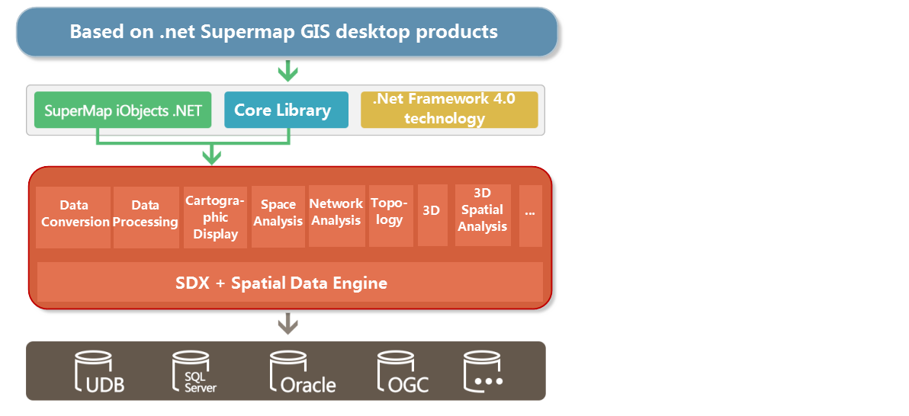
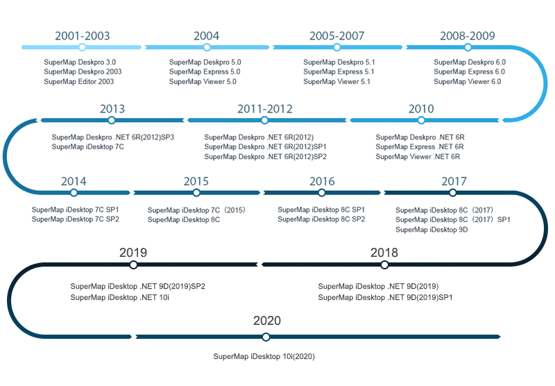

　SuperMap iDesktop is an enterprise desktop GIS application and development platform that can efficiently perform various GIS data processing, analysis, 2D and 3D mapping and publishing, etc. You can quickly build your own desktop GIS application platform. SuperMap iDesktop is a plug-in GIS application built by SuperMap iObjects. NET 10i, desktop core libraries and .NET Framework 4.0 to meet the needs of different users. includes x64 (64 bit) and x86 (32 bit) packages.

SuperMap iDesktop provides lots of 2D&3D integration features like data management and processing, edit, mapping, analysis, 2D/3D plotting and so on. SuperMap iDesktop has supports to nautical charts and can access online map services and share cloud/client resources, and it can be customized and developed for data producing, data processing, analyzing and business applications.

  

###  Function description:

**Data Management**

  * Supports UDB and UDBX engines.
  * Suportive database engines contain: PostGIS, DM, Oracle, SQL Server, PostgreSQL, BeyonDB MongoDB.
  * Supports POLARDB and GaussDB databases.
  * Open Web maps directly like OGC services, REST services, Google maps, Baidu maps, SuperMap Cloud services, MapWorld services, OpenStreetMap and so on.
  * A huge amount of image data can be managed and visualized in the way of mosaic datasets.
  * Provides various tools to manage data conveniently including Start tab, Catalog, Search, etc. 

**Data Processing**

The choice of many projection and geographic coordinate systems, datasets from different places can be integrated into the same frame. Provides comprehensive data-editing features, and over 30 methods for vector and raster data processing to help users produce professional maps. Besides, provides lots of methods for processing raster, image data and the result data can be used as base maps or involve in analysis. Include:

  * Calculate conversion model parameter values from coordinate systems, and supports 10 coordinate system transformation models.
  * Topologically check and process data.
  * Store 2D/3D map tiles to MongoDB or GeoPackage which greatly improves the efficiency of browsing huge amount of data.
  * Over 200 data processing features are provided including: dissolve, append, rarefy and so on.

**Mapping and visualization**

Provides comprehensive map features like map display, rendering, editing, and so on. Rich visualization, easy-to-use graphics tools for high-quality maps without complex designs. include:

  * Built-in 7 swatches, more than 200 ribbons, more than 1000 point, line, and region symbols.
  * Supports to generate map tiles, update/append tiles, check tiles, and publish tiles. 
  * Supports to generate map tiles meeting MapBox MVT specification in the way of multiple-processes-multiple-machines thereby save the time and improve greatly tile-generated efficiency.
  * Provides various mapping tools including map subdivision, map grid and so on.
  * Provides the functions of making and modifying various thematic maps such as unique value thematic maps, range thematic maps, label thematic maps, statistics thematic maps, dot density thematic maps, customization thematic maps, grid unique value, and grid range thematic maps.

**AI Mapping**

* Extracts colors from an image and transfers them to your map.
* Makes your map black&white; or gray by one click. Or you can invert your map.
* You can undo or redo the last operation.

**Spatial analysis**

Provides kinds of analysis features including basic vector/raster analysis,
and advanced analysis features to help resolve real problems.

* Supportive analyses: create buffers, overlay, interpolate, hydrology analysis, dynamic segmentation.
* Provided surface analyses: extract contours/isoregions, slope, aspect, cut and fill, 3D hillshade and so on.
* Served traffic analyses: optimal path, TSP, transfer, path, navigation and so on.
* Supportive network analyses: key element, connectivity, single element tracing, connected element, tube burst and so on.

**Spatial Statistic Analysis**

 * Provides a series of measurement geographic analyses including central element, mean center, median center, directional distribution, and so on.
 * Introduces multiple analysis modes including spatial autocorrelation, high/low clustering, incremental spatial autocorrelation, and average nearest neighbor.
 * Serves clustering distributions including hotspot analysis, cluster and outlier analysis, and optimized hotspot analysis.
 * Implemented geographically weighted regression analysis. 

**Diagram**

 * 11 kinds of diagrams are provided to visualize datasets' attributes to help people mine relationships, structures and trend of data.
 * Associated display between diagrams is supported to help people analyze characteristic distribution of data in geography.
 * The conversion between a diagram and a thematic map is introduced to quickly show data information in different ways.
 * A diagram can be exported to a picture which can be used in documentation tools like Word, PPT, etc.

**3D**

 * Display and browse multiple-sources data including image data, terrain data, 3D model data, vector data and 2D maps.
 * Provides rich, fascinating 3D special effects to make 3D scene more real like sun light, ocean water, seafloor, underground scenes, particle effects (fire, rain, snow, geysers, etc.).
 * All kinds of 3D spatial analyses and network analyses and results can be saved.
 * The fly management provided make the fly simulation come true.
 * Support the management and display of data such as oblique photography model, BIM, laser point cloud.
 * Local oblique photography data can be uploaded to SuperMap iServer or SuperMap Online.

**Nautical chart**

To save, display and release nautical chart data.

 * Provides the feature of converting nautical chart data based on the newest S-57, IHO Transfer Standard for Digital Hydrographic Data.
 * Importing S-57 nautical data is allowed, saving and exporting the nautical chart are allowed too.
 * Displaying nautical data based on the newest S-52 IHO display standardization of electronic charts.
 * Display status of features in nautical charts can be controlled now, and attributes of nautical features are allowed to edit and so people can add or modify them conveniently.

**Co-ordination between cloud products and client products**

 * Directly access standard online map services like WMS, WFS, WMTS, SuperMap REST, MapWorld and so on.
 * Publish a map, tiles and 3D scene to a iServer service with one click.
 * Manage online data and online services in SuperMap Online or SuperMap iPortal.
 * Retrieve and share maps, data, symbol libraries, color schemes, plugins and customized resource.

**Customized development**

 * Provide varieties of VS project templates, in the meanwhile, iDesktop Toolbox is integrated in the IDEA, iDesktop quick reference is integrated in the Visual Studio to help people develop new features.
 * The product interface can be customized with the work environment designer.
 * Loading, customizing, developing plugins are allowed, at the same time, you can download, share and uninstall plugins.

**Geoprocessing Modeler (GP Modeler)**

 * Provides a toolbox. You can search and locate any tool.
 * Introduces 6 kinds of toolsets like vector analysis, raster analysis, mapping, and so on.
 * You are allowed to import and export models.

**Custom Development**

 * Provides various VS project templates. Besides, IDE integrates iDesktop toolbox and iDesktop quick reference for user development.
 * You can reorganize iDesktop interface with the work environment design tool. 
 * You can custimize plugins to extend iDesktop functions.

###  Version history:

  
---  
