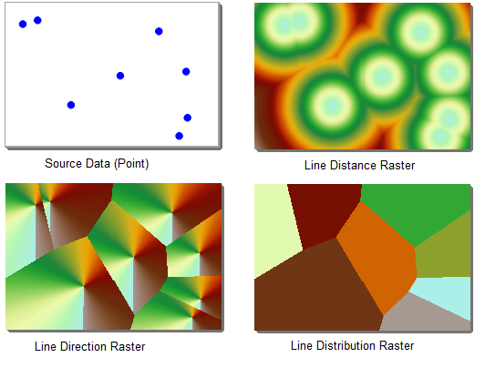
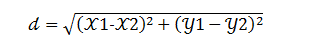
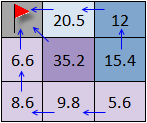
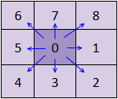
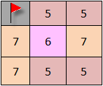
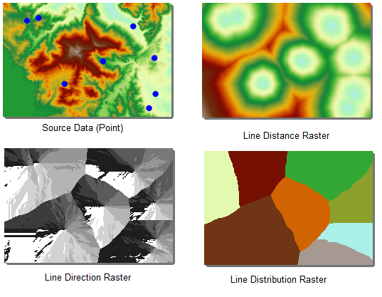
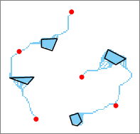
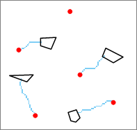

Distance raster analysis is to perform analysis with the distance between each cell and its neighboring cells (source), and show the spatial relationship of them. Both the raster surface distance and cost will be taken into consideration. Distance analysis can be used to get many useful information, guide resource management and planning, such as to find the distance from the earthquake region to the nearest hospital, and the estimate of the service area for the chain supermarket. The distance raster analysis functionality provided by the application including generate distance raster, calculate shortest path and calculate the shortest path between two points.

Distance Raster includes three aspects of content:

  * First, the feature calculates the distance (that can be the straight distance, the cost distance or the surface distance) for each cell to the closest source and generate corresponding direction raster and allocation raster. 
  * Second, according to direction raster and allocation raster analyzes and gets the shortest path between the target to the source. 
  * Third, calculates the shortest path between two points (source and target). The shortest path could be the minimum cost path and the shortest surface path.

### Basic conception

The essential words related to distance raster include:

**Source:** The source can be any object like a school, a road, a fire hydrant, and so on.

**Source dataset:** the source dataset includes the source. It can be a 2D point, line, region, or raster dataset. For a raster dataset, all cells should have NoValue except the source cell.

**Distance:** you can calculate a straight distance, cost distance, and surface distance.

  * The straight distance is the Euclidean distance that is the straight distance for each cell to the closest source.
  * The cost distance is the cost value from the source to the closest target cell by weighting attributes of the source point.
  * The surface distance is the real surface distance from the cell (obtained according to surface raster) to the closest source.

The straight distance is the simplest cost. But in real life, there are a lot of objects (like rivers, mountains, etc.) on the ground. Therefore, it is almost impossible to arrive a target as the straight distance.

**Cost Raster** : Both the generation of distance raster and the calculation of the minimum cost path need cost raster. Cost raster is used to specify the cost needed for passing each cell. The value of a cell represents the cost of passing one unit of this cell. Hence, the value can't be negative. For example, a cost raster represents the cost of a car in different ground environments. The value of a cell represents the resistance value for travel 1 kilometer in the cell, and so the total cost for the car to pass the cell is the cost value (cell value) multiply by the size of the cell. The unit of the cost raster can be of any unit, such as length, time, price, etc., or the cost can have no units, such as the slope, exposure, and land use after a reclassification.

### Generate distance raster

Generate distance raster is used to calculate the distance between each cell and the source data in a raster data. The result got can be used to resolve three problems:

  * The distance between each cell and the nearest source data, for example, the distance to the nearest school.
  * The direction between each cell and the nearest source data, for example, the direction to the nearest school.
  * The cells to allocate to the source data according to the spatial distribution, such as the location of the several nearest schools.

Three kinds of datasets will be got: distance raster, direction raster and allocation raster. As shown below.

  
  
**Distance raster**

Distance raster including straight-line distance raster and cost distance raster.

 1. Straight-line distance raster 

The value of straight-line distance raster represents the Euclidean distance (straight-line distance) between a cell and its nearest source. The cost of the straight-line distance can be considered as the distance, it is the simplest cost. Straight line distance raster does not consider cost, that is the path has no barrier or has the same cost. The source data to create straight-line distance raster can be vector data (point, line, region) or raster data. The results including straight-line distance raster dataset, straight-line direction raster dataset and allocation raster dataset.

A straight-line distance raster is the result by calculating the distance between each cell to the closest source. If the coordinates of point A are (x1,y1) and those of point B are (x2,y2), the Euclidean distance between the two points is:

  

 2. Cost distance 

The value of cost distance raster represent the cost value between the cell to the nearest source (it can contain all kinds of cost factors, or the weighting of all interested cost factors). For example, the distance traveled when coming over the mountain is small, but the time cost may be larger than bypassing it. On the other side, there are different kinds of ground overlays, and generally, it is impossible to reach the source with the straight line path, and you must make a detour to avoid barriers such as rivers and mountains, so the cost distance can be viewed as the extension of straight line distance. Since the distance raster records the distance between each cell and the nearest source, it can be used for site selection analysis with the condition "the distance between the point and the nearest resource point is less than certain value".

**Direction raster**

Direction raster represent azimuth direction between each raster cell and its nearest source. It all contains straight line direction raster and cost direction raster. The value of straight line direction raster represents the azimuth form a cell to its nearest source, the unit is degree. The north is 0 degree, makes clockwise rotation, the range is 0-360 degree. For example, if the nearest source is to the east of the cell, the value of the cell is 90 degree.

The value of the cost direction raster represents the direction from a cell to its nearest source with the least cost path. As shown below, for the raster data shown in figure 1, the least cost path form each cell to the source (represented by small red flag) is identified with arrows, since the values represent the direction is shown as figure 2, the direction values for the cells in figure 1 is as fig3, fig3 is the cost direction raster of the raster data in fig1. The value of the source cell in the cost direction raster dataset is 0. The cells in the direction dataset with the value 0 are not all sources, for example, if a cell has no value in the input raster dataset, it's value will also be 0 in the output cost direction dataset.

      
  
**Allocation raster**

Allocation raster is to allocate spatial resource (raster cells) to different source objects, for example, representing the service areas of post offices.

Allocation raster including straight line allocation raster and cost allocation raster. Allocation raster is also called service raster, its raster value is the value of the nearest source, so you can know which source is nearest to each cell from the allocation raster. When calculating straight-line distance, the nearest source is determined by the straight-line distance; when calculating cost distance, the nearest source is determined by the cost distance between the cell and the source.

The figure below shows the raster data result got by performing the generating cost distance raster, in the analysis, the source data is a point dataset, and the DEM data is the cost data.

  
  
### Compute the shortest path

The feature is to calculate the shortest path from the target to the nearest source based on the target point data and the distance/direction raster created by the generate distance raster function. For example, the shortest path from a point in the suburbs to the nearest market (target data). 

For example, analyze how to get to the nearest shopping mall (point data set) from each residential plot (area dataset). Firstly, the shopping mall is taken as the source, and the consumption raster and consumption direction raster are generated. The shortest path analysis is carried out on the basis of the generated consumption distance raster and the consumption direction raster, and the residential area can be obtained to the nearest shopping mall (source) of the shortest path.

There are three modes for calculating the shortest path:

 1. Cell path: A path is generated for each grid cell, connecting that cell with the closest source. 

As shown in the following figure, the red dot is used as the source and the black box polygon is used as the target. The shortest path of the raster is analyzed and the shortest path represented by the blue cell is obtained.

  

 2. Zone path: A path is generated for each cell zone. A cell zone is composed of contiguous cells with equal values. A path for a target zone is the least-cost path from the zone to the closest source. 

As shown in the following figure, the red dot is used as the source and the black box polygon is used as the target. The shortest path of the raster is analyzed and the shortest path represented by the blue cell is obtained.

  

 3. Single path: Only one path is generated for all grid cells. This path is the one with the least cost among all the paths connecting the entire target area dataset. 

As shown in the following figure, the red dot is used as the source and the black box polygon is used as the target. The shortest path of the raster is analyzed and the shortest path represented by the blue cell is obtained. 

  

### Calculate the shortest path between two points

Calculate the shortest path between the source point and the target point. Calculate the shortest surface path, least cost path and least cost path considering the surface distance.

### Cost distance

It is needed to specify the cost raster when calculating least cost path. Cost raster is used to specify the cost needed for passing each cell. The value of a cell represents the cost of passing one unit of this cell. For example, a cost raster represent the cost for car in different ground environment, the value of a cell represents the resistance value for travel 1 kilometer in the cell, so the total cost for car to pass the cell is the cost value (cell value) multiply by the size of the cell. The unit of the cost raster can be of any unit, such as length, time, price, etc., or the cost can have no unit, such as the slope, exposure and land use after reclassify. Usually, in a research, there may be many factors that influence the cost, for example, in the planning of a new road, the factors that influence the cost may include the total length, the land use of the passed area, slope, the distance to the population concentration area, etc. It is needed to weight the factors to get a comprehensive weight as the cost data. Note that the cost cannot be a negative value.
