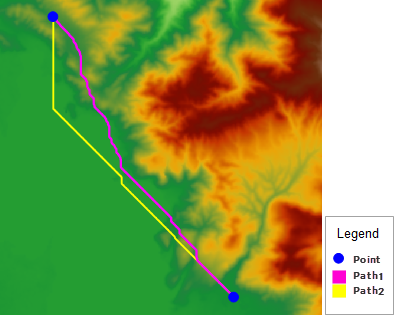
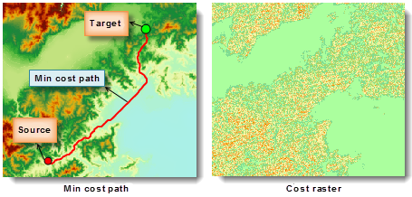

According to the settings of the parameters, there are two different types of shortest paths between two points.

1. If specify the DEM raster only (the source data is DEM raster data), the result is the shortest surface path obtained by performing the feature [Shortest Surface Path](TwoPointDis).
2. If specify the cost raster only (the source data is cost data), the result is the least cost path obtained by performing the feature Least Cost Path .

The following picture is the shortest surface path and the least cost path, and both the start point and the end point are the same.

  

The blue points are the starting point and the ending point. Path1 is the shortest surface path obtained with only DEM raster specified, while Path2 is the least cost path obtained with only the cost raster specified.

### Introduction

Calculates the least cost path from the source point to the target point along the cost raster surface.

Apart from the source point and the target point, you need to set some other parameters.

  * The required parameters include cost raster, result datasource, and result dataset.
  * Other optional parameters include the smooth method and the smoothness of the result path.

### Functional Entrances

* Click **Spatial Analysis** > **Raster Analysis** > **Distance Raster** > **Least Cost Path**.
* **Toolbox** > **Raster Analysis** > **Distance Raster** > **Least Cost Path**. (iDesktopX)

### Parameter Description

* **Cost Data** : Specify the cost data that can determine the cost of passing each cell.
* **Parameter Settings**. You can set the smooth parameters to smooth the result. 
  * **Smooth Method** : Two smooth methods are provided including B Spline and Polish. For the specific information on smooth methods, see [Smooth Methods](../../DataProcessing/Vector/SmoothMeth).
  * **Smoothness** : The value of smoothness is related to the smooth method. For B Spline, when the smoothness is less than 2, it will not work. For Polish, it is valid when the smooth degree is equal or greater than 1. The larger the smooth degree is, the smoother the line is.
* **Barrier Region Settings** : you can specify a region dataset. Objects in this dataset will be considered as barriers when analyzing data to match real requirements better. For example, if you want the lost cost path between two points to round a lake, you can specify the lake data as the barrier region. For specific information, please refer to [Calculating Shortest Surface Path Between Two Points](TwoPointDis#1).

* **Result data** : Select the datasource and enter the name of the result dataset.

The figure below shows the least cost path between the two points. We set the reclassified result of the DEM raster to the cost raster. The feature analyzed and calculated the least cost path between the given two points.

  

### Note

The raster value in the consumption data must be greater than 0 to analyze successfully. If the raster value is less than 0, the analysis will fail.
