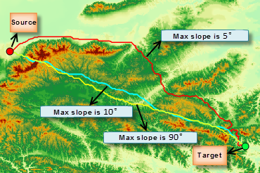
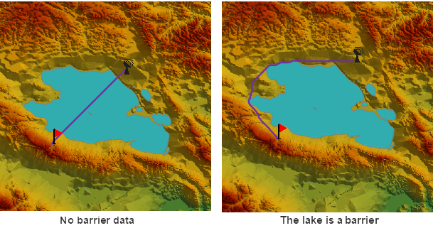

---
id: TwoPointDis
title: Shortest Surface Path Between Two Points
---
According to the settings of the parameters, there are two different types of shortest paths between two points.

1. If specify the DEM raster only (the source data is DEM raster data), the result is the shortest surface path obtained by performing the feature Shortest Surface Path.
2. If specify the cost raster only (the source data is cost data), the result is the least cost path obtained by performing the feature [Least cost path](TwoPointCostDis).

The following picture is the shortest surface path and the least cost path, and both the start point and the end point are the same.

  

The blue points are the starting point and the ending point. Path1 is the shortest surface path obtained with only DEM raster specified, while Path2 is the least cost path obtained with only the cost raster specified.

### Introduction

Calculates the shortest surface path between the source point and target point.

Apart from the source point and the target point, you need to set some more parameters.

* The required parameters include surface distance raster, result datasource, and result dataset.
* Other optional parameters include the smooth method and the smoothness of the result path.

### Functional Entrances

* Click **Spatial Analysis** > **Raster Analysis** > **Distance Raster** > **Shortest Surface Path**.
* **Toolbox** > **Raster Analysis** > **Distance Raster** > **Shortest Surface Path**. (iDesktopX)

### Parameter Description

* Specify the terrain data which provides the elevation information for the distance calculation.
* **Parameter Settings. You can set the smooth parameters, the maximum upslope degree and the maximum downslope degree.
  * **Smooth Method** : Two smooth methods are provided: B Spline and Polish. For the illustration of smooth methods, see [Smooth Methods](../../../DataProcessing/Vector/SmoothMeth).
  * **Smoothness** : The value of smooth degree is related to the smooth method. B Spline works if the smooth degree is less than 2. Polish is valid if the smooth degree is greater than or equal to 1. The larger the smooth degree is, the smoother the line is.
  * **Max Upslope** : The upslope angle is the angle between the upslope direction and the horizontal plane. The direction with a upslope degree larger than the given max upslope degree will be ignored, which means the path will not pass the cell. The default angle is 90° that means no restriction for the upslope angle.
  * **Max Downslope** : The downslope angle is the angle between the downslope direction and the horizontal plane. The direction with a downslope degree less the given max downslope angle will be ignored, which means the path will not pass the cell. The default value is 90° that means no restriction for the downslope degree.

Note: After setting the max upslope angle and the max downslope slope, maybe you can not get any path because of no matched paths.

The figure below shows the resulting paths between two points with a different max upslope/downslope angle.

  

* Barrier Region Settings: you can specify a region dataset. Objects in this dataset will be considered as barriers when analyzing data to match real requirements better. For example, if you want the lost cost path between two points to round a lake, you can specify the lake data as the barrier region. The following three ways are provided for barrier selection.
  * Dataset: Specify a dataset in the current workspace as the barrier data./li> 
  * Draw Region: Check **Custom Locale** , and then you can draw a polygon on the source data as the barrier data.
  * Select Region: This feature is active only when there is at least one region dataset opened in the current map window. This feature allows you to choose a region object as the barrier data.

**Note** : The selected dataset or region object must use the same coordinate system as the source data.

Given the same data, without specifying the lake as a barrier, we got the left result shown in the following picture. When specifying the lake as a barrier, we can find that the resulting path (shown on the right picture) rounded the lake.

  

* **Result data**. Select the datasource and enter the name of the result dataset.
