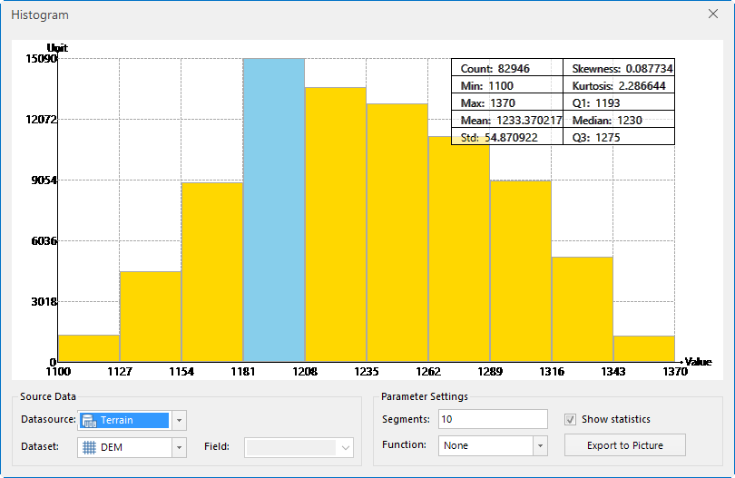

Application provides the histogram function, which is convenient for users to view the distribution of sample points. Click the **Histogram** button on the **Spatial Analysis** tab.

Histogram is also called frequency distribution histogram. Each column represents the relative frequency in particular area or a particular group. The following figure shows the frequency distribution of a field in a dataset (15 groups):

  
  
By using a histogram, you can check the shape of the sample distribution.

### **Instruction to the "Histogram" Dialog Box**

The upper chart region is mainly used to display the histogram and statistical information; the lower part is used to set the statistical data and parameter of the histogram.

**Chart Region**

X-axis denotes the value of every sample point; Y denotes the number of the sample points. The top-right region shows the statistical results of all the sample points including the count of sample points, minimum, maximum, mean, standard deviation, skewness, kurtosis, median, first quartile and third quantile.

**Source Dataset**

- **Datasource** : Lists all the datasources in the current workspace; selects the datasource where the point dataset is to be analyzed.

- **Dataset** : Lists all the point datasets in the datasource; selects a point dataset as the analytical dataset.

- **Field** : Selects a field of the point dataset as the analytical field. The attribute information cannot be null in the field, otherwise, a dialog box will be pop-up and show "Exists null values so that the statistical operation cannot be performed".

- **Parameter Settings**

- **Segments** : Inputs an integer as the number of the segments (i.e., the number of the histograms).

- **Function** : It is the function to convert the field value. The system provides NONE (null function which is not to convert the values), LOG (logarithmic function) and ARCSIN (arc-sin function). When the sample points are interpolated by the transform functions, some interpolation methods assume that the data are normally distributed. If the sample points do not follow a normal distribution, you need to transform the data to make the data normally distributed. The three functions are illustrated as follows:
  * **None** : Null function which is not to convert the values uses the raw data to interpolate.
  * **Log** : Logarithmic function is used to convert the raw data using the natural logarithm as the bottom of the logarithm transform. The logarithm transform is applicable to the data which are positively skewed and whose peak value is in the left of the plot (i.e., the sample point whose median is greater than the middle value). The domain of the logarithmic function is the real number greater than 0, so you need to ensure it meets the condition during the logarithm transform.
  * **Arcsin** : Arc-sin function is to perform the arc-sin transform for the raw data. It is applicable to the data that is proportional or distributed by percentage. The domain of the function is [-1,1], so you need to pay attention on the value range of the statistical field during the arc-sin transform. 

- **Show Statistics** : Selects the check box, then the statistical information of the histogram will be showed on the top-right of the plot. If the check box is not be selected, the statistical information will not be showed.

**Statistical information include**

* **Count** : The total number of the sample points.
* **Min/Max/Mean/Std** : The minimum, maximum, mean and standard deviation of the statistical results.
* **Skewness** : Describes the symmetry of the distribution. If it is a symmetrical distribution, the value is 0; if the curve is left-skewed, the value is positive and now the mean is greater than the median; if the curve is right-skewed, the value is negative and now the mean is less than the median.
* **Kurtosis** : The index of the possibility that the distribution produces outliers. The value is 3 for the normal distribution; the value is greater than 3 when the distribution shows a triangle cap; the value is less than 3 when the distribution is flat.
* **Q1/Q3** : It is equivalent to the 0.25 times and 0.75 times of the cumulative proportion respectively. All the data are sorted in an ascending order, the Q1 denotes the value on the 1/4 location of the serial numbers, and Q3 denotes the value on the 3/4 location of the serial numbers.
* **Median** : It is equivalent to the 0.5 times of the cumulative proportion. All the data are sorted in an ascending order, the median denotes the value on the 1/2 location of the serial numbers. If the total number of the cells is an even number, here it will select the first median as the value.

**Export to Picture** : Exports the histogram as a picture. The supported formats are bmp, emf, eps, jpg, png, tif, etc.

### Note

When the mouse rolls over of selects a certain histogram bar, it will display the information of the bar in a real time including the pixel count, minimum and maximum.

  * **Objects** : The total number of the points of the selected histogram bar.
  * **Min/Max** : The minimum/maximum value of the statistical results of the selected bar. 
