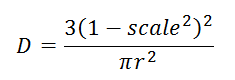
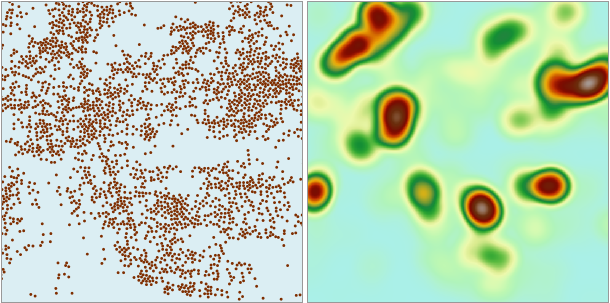

### Introduction

Kernel density is used to calculate the density of point and line feature measurement values in the neighboring range. Simply speaking, kernel density can vividly reflect the distribution of dispersed measurement values in the continuous range. The result is smooth curve with values in the middle greater than those peripheral values.

Kernel density is used to calculate population density, building density, acquire crime report, simulate population density in the tourist area, chain store management, etc. For example:

  * We already know there are multiple high-rise apartments and residential in a street block and the occupancy of each building is known, this function can be used to understand the population distribution of each street block. It is equivalent to distribute the population of each building according to the trend of kernel function to the designated neighborhood, plus the overlapping areas, and finally get area population density of each street area. The population density results can be used to solve problems such as store location decision, crime rate estimation, etc.
  * There are many retail chain stores in an area. Assume that every customer only goes to the nearest store. According to the field on the distance from a customer to a store, the grid map about the customer distribution of each store will be acquired.
  * If we are going to build build roads (or utility lines) for an area, we can calculate the impact of road (utility lines) on wildlife habitat according to the corresponding field. 

### Theory

The function used by the kernel density analysis is:

  
  
Where r is the searching radius, scale is the ratio of distance and searching radius from grid center to point and line objects.

For the point object, the space volume combined by kernel surface and bottom plane is similar with the product of line measurement and line length. The neighborhood overlay of point or line has the same density. Every density of output is the sum of curved surface value overlayed in raster.

The unit of the result grid values is the reciprocal of the square of the unit of the original dataset. For example, if the unit of original dataset is a meter, the unit for result grid values is per square meters.

Open the datasource Shop in the folder ExerciseData/RasterAnalysis. We take the Shop point dataset as an example.

### Functional Entrances

  * Click the **Spatial Analysis** > **Raster Analysis** > **Density Analysis** > **Kernel Density Analysis**. 
  * **Toolbox** > **Raster Analysis** > **Density Analysis** > **Kernel Density Analysis**. (iDesktopX)

### Parameter Description

  * **Source data**
    * **Datasource** : The datasource where the dataset ready for kernel density analysis is located.
    * **Dataset** : The dataset ready for kernel density analysis. The system will automatically filter the datasets in the datasource and only point and line datasets will display.
    * **Density Field** : The field for density analysis, with the non-numeric fields will be filtered out. Therefore, before analysis, you should select a related field.
    * **Search Radius** : All the sample points within the specified radius will take part in the density calculation of grid cells.
  * **Analysis Bounds**: Used for display and set kernel analysis bounds. The default value is the bounds of the dataset.
    * **Selected Region** : Click the Selected Region button to set a selected region object in the map window to analysis bounds.
    * **Reset** : Click the Reset button to set the analysis bounds as the dataset bounds.
    * **Copy and Paste** : Click the Copy button to copy the currently set range, click the Paste button at the list of supported patches, the left, down, right and top values are set to the current range.
  * **Result Data**
    * **Datasource** : The data source that the results of the kernel density analysis will be saved to.
    * **Dataset** : The name of the result dataset where the kernel density analysis result stores. If the dataset name input already exists, a message that tells the dataset name is invalid will be presented for you to reenter the dataset name. 
    * **Resolution** : The resolution of the kernel density analysis, that is, the ground area corresponding to a single pixel, with the unit consistent with the dataset unit.

The following picture is about the distributions of members of a chain. 
  

From the analysis results can be seen that the members distribution is more intensive in the darker place, the distribution of shallow color is relatively sparse.
