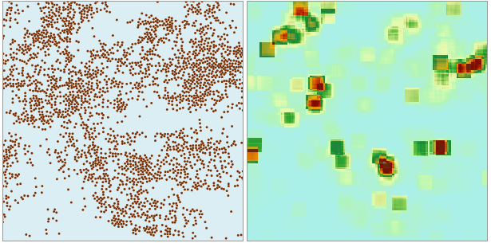

### Introduction

Simple Point Density Analysis calculates the density of point features around each output raster cell. Conceptually, a neighborhood is defined around each raster cell center, and the number of points that fall within the neighborhood is totaled and divided by the area of the neighborhood.

The unit of the result raster grid value is reciprocal to the squared value of the source map. For example, if map units are meters, so default units of density are points per square meter in the neighborhood.

Note: For geographic coordinate systems, there is no any sense if the units are in degrees.

Open the datasource Shop in the folder ExerciseData/RasterAnalysis. We take the Shop point dataset as an example.

### Functional Entrances

  * Click the **Spatial Analysis** > **Raster Analysis** > **Density Analysis** > **Simple Density Analysis**. 
  * **Toolbox** > **Raster Analysis** > **Density Analysis** > **Simple Density Analysis**. (iDesktopX)

### Parameter Description

  * **Source Data**
    * **Datasource:** select the datasource that contains the dataset to analyze.
    * **Dataset:** Select the dataset to analyze. Only point datasets will be eligible and displayed here.
    * **Density Field:** the value of the density field determines the number of times to count the point. Only numeric fields will be displayed in this option.
  * **Analysis Range**: This is used to set the analysis area for the Kernel Density Analysis. By default, it is the same with the dataset extent.
    * **Select Region:** Click this button to select a region feature in the current map window as the analysis area.
    * **Reset:** Click Reset to restore the specified analysis area to the dataset extent.
    * **Copy and Paste** : Click Copy button to copy the current range, and click Paste button at the settings that support pasting to set the value of the copy range to the current range.
  * **Result Data**
    * **Datasource:** The data source that the result dataset of analysis will be saved to.
    * **Dataset:** Specify the name of the dataset to save the analysis result to.
    * **Resolution:** The resolution of the analysis is the size of the ground area that one pixel represents. The unit is in accordance with that of the dataset.
  * **Shape Settings**
    * **Shape Type** : Specify the shape of the neighborhood. Four shapes are supported: Rectangle, circle, annulus, wedge. Different shapes have different parameters to set. 
      * **Rectangle:** for rectangle neighborhood, its width and height should be set.
      * **Circle:** for circular neighborhood, its radius should be set.
      * **Annulus:** for a donut neighborhood, its outside and inside radius should be set.
      * **Wedge:** for wedge neighborhood, its starting and end angle [0, 360] and radius should be set.
    * **Unit Type:** Grid coordinate system and GCS (Geographic Coordinate System) are supported. For grid coordinate system, the unit is in columns and rows, that is the pixel, by default, it is 3 pixels; for GCS, the unit is the same with that of the dataset, by default, it is one twentieth of the dataset extent. 

The following picture shows a sample point density analysis result for a Chain shop membership.

  

From the analysis results can be seen that the members distribution is more intensive in the darker place, the distribution of shallow color is relatively sparse.

