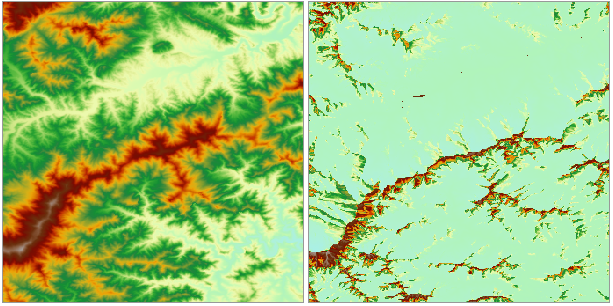

### Introduction

The function of Solar Radiation Analysis enables you to map and analyze the effects of the sun over a geographic area for specific time periods. It accounts for atmospheric effects, site latitude and elevation, steepness (slope) and compass direction (aspect), daily and seasonal shifts of the sun angle, and effects of shadows cast by surrounding topography.

With landscape scales, topography is a major factor that determines the spatial variability of insolation. Variation in elevation, orientation (slope and aspect), and shadows cast by topographic features all affect the amount of insolation received at different locations. This variability also changes with time of day and time of year, and in turn contributes to variability of microclimate including factors such as air and soil temperature regimes, evapotranspiration, snow melt patterns, soil moisture, and light available for photosynthesis.

Incoming solar radiation (insolation) originates from the sun, is modified as it travels through the atmosphere, is further modified by topography and surface features, and is intercepted at the earth's surface as direct, diffuse, and reflected components. Direct radiation is intercepted unimpeded, in a direct line from the sun. Diffuse radiation is scattered by atmospheric constituents, such as clouds and dust. Reflected radiation is reflected from surface features. The sum of the direct, diffuse, and reflected radiation is called total or global solar radiation.

Knowing about the amount of insolation at a specific geographic location is very helpful for applications in diverse fields, such as agriculture, resource management, meteorology, civil engineering, and ecological research.

  * For example, knowledge of how much sun an area receives over a period of time may be useful in determining a new site for a ski resort or the best locations for growing specialty crops where specific microclimate conditions are needed for optimal growth. 
  * For civil engineering and urban planning, insolation can be an important input for suitability models used to determine optimum sites. 
  * By analyzing the direct, diffuse radiation and the duration of direct radiation, etc, you can decide the best places to grow fruits like apples, or any other crop.

### Functional Entrances

* Click the **Spatial Analysis** > **Raster Analysis** > **Solar Radiation**. 
* **Toolbox** > **Raster Analysis** > **Solar Radiation**. (iDesktopX)

### Parameter Description

  * **Terrain Data** : specify the DEM dataset and the datasource it is in.
  * **Analysis Type** : You can calculate solar radiation either for a period of time in a year or a span of time within a day. 
    * **Annual Radiation Analysis** : check this option to calculate solar radiation for a period of time in a year. The period is determined by a starting date and an end date. Users only need to select the month and the day. The year is not taken into any consideration. 
      * Starting Time: click to select or input manually the starting month and day.
      * Ending Time: click to select or input manually the ending month and day. Note that, if the input starting date is later than the ending date, it will automatically goes to the next year. 
      * Sampling Interval (Day): Set the interval of sampling by days. By default, the value is 14. It means the radiation for the area is calculated every 14 days.
      * Sampling Interval (Hour): Set the interval of sampling by hours. By default, the value is 1. It means the radiation for the area is calculated every 1 hour.
    * Day Radiation Analysis: check this option to calculate solar radiation for a span of time in a day. The period is determined by a starting hour and an end hour. Users only need to select or input the hours. 
      * Starting Time: Users can select or input the hour to start. By default, it is 00:00.
      * Ending Time: Users can select or input the hour to start. By default, it is 23:59. Note that, the ending hour must be later than the starting hour. 
      * Sampling Interval (Hour): Set the interval of sampling by hours. By default, the value is 0.5. It means the radiation for the area is calculated every 0.5 hour.
  * In the Radiation Parameter, you can set the two important parameters required for solar radiation analysis, ie, Regional Latitude, Transmissivity. 
    * **Regional Latitude:** Used to display and set the mean latitude of the analysis area. The analysis is designed for local landscape scales, therefore, it is recommended to use one latitude value for the whole DEM. With large datasets (i.e., states, countries or continents), the insolation results will differ significantly at different latitudes (greater than 1 degree). For broader geographic regions, it is necessary to divide the study area into zones with different latitudes. 

If the DEM is in a planar coordinate system, you need to set the location based on the analysis area; if the DEM is in a spherical or projected coordinate system and in a right location, the system will read the mean latitude automatically, and manual setting is not allowed. If the latitude is in a wrong extent, then you need to input it manually.

  * **Transmittivity:** The fraction of radiation that passes through the atmosphere (averaged over all wavelengths). Values range from 0 (no transmission) to 1 (all transmission). The default is 0.5 for a generally clear sky.
  * The specified elevation factor (the coefficient for transforming Z values to values with X and Y units in a Grid). For a calculation involving X, Y, and Z values, usually a zFactor needs to be set to make their units consistent. For example, X and Y units are meters, and Z unit is feet. One feet is equal to 0.3048 meter, so the specified zFacor is 0.3048. If you set it as 1.0, then it will not zoom. 

It is recommended to have your data in a projection coordinate system (units meters). However if you choose to run the analysis with a spherical coordinated system you will need to specify an appropriate z-factor for that latitude. If your x,y units are decimal degrees and your z units are meters, some appropriate z-factors for particular latitudes are:

            
                        
               **Latitude**     **Z-factor**
                   0         0.00000898
                  10         0.00000912
                  20         0.00000956
                  30         0.00001036
                  40         0.00001171
                  50         0.00001395
                  60         0.00001792
                  70         0.00002619
                  80         0.00005156
            
            

*  **Result Raster** is used to set the dataset to save the result and name the result dataset as well as specifying the datasource. 
    - * **Datasource:** Set the datasource to save the dataset.
    - * **Total Radiation:** Name the dataset for the total radiation. By default, the dataset is named as TotalDatasetGrid.
    * Direct Radiation: if you check the Direct Radiation box, a raster dataset for the direct radiation amount will be generated. You can input a name for the result dataset. By default, it is named as DirectDatasetGrid.
    * Diffuse Radiation: if you check the Diffuse Radiation box, a raster dataset for the diffuse radiation amount will be generated. You can input a name for the result dataset. By default, it is named as DiffuseDatasetGrid.
    * Direct Duration: If you check this Direct Duration box, you will get the total time of direct duration for the specified analysis period. You will get a direct duration dataset with a default name: DurationDatasetGrid

  

###  Note

  1. Because insolation calculations can be time consuming, it is important to be sure all parameters are correct. Calculation for a large digital elevation model (DEM) can take hours, and a very large DEM could take days.
  2. For day radiation analysis, the maximum range of time is one day (24 hours). Calculations will not be performed across days (for instance, from 12:00 p.m. to 12:00 p.m. the next day). The start time must be less than the end time.
  3. For annual radiation analysis, the maximum range of days is a total of one year (365 days, or 366 days for leap years). If the start day is greater than the end day, the time calculations will proceed into the following year.

