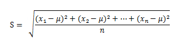

---
id: BasicStatistic
title: Basic Statistics
---
### Introduction

Calculate the basic statistics information of the cells of the input raster data, and show the statistical result and gray information with histogram visually. The statistical contents include: maximum value, minimum value, mean value, standard deviation and variance.

### Function Entrance

  * Click **Spatial Analysis** > **Raster Analysis** > **Raster Statistics** > **Basic Statistics**.
  * **Toolbox** > **Raster Analysis** > **Raster Statistics** > **Basic Statistics**. (iDesktopX) 

### Parameter Description

  * **Source Dataset** : Select the raster data for statistics, including the datasource and dataset that contains the data.
  * The statistics region displays the following content after a basic statistics. 
    * **Max** : Find the maximum value in the raster cells.
    * **Min** : Find the minimum value in the raster cells.
    * **Mean** : Calculate the mean value of all the cells in the raster data.
    * **Standard Deviation** : Calculate the standard deviation of all the cells in the raster data. Standard deviation is the mean value of the differences between the data and the mean value, and it reflects the dispersion of the data. Standard deviation is the square root of variance. As shown below, x1,x2,x3,......xn is a group of sample data, µ is the mean value of them. The formula to calculate is as the following:   
    * **Variance** : Calculate the variance of all the cells. Variance is the sum of all the squares of the difference between the cell values and the mean value.
  * **Histogram** : Click Histogram to view the histogram of the current raster data. See [Raster Histogram](../Histograms) for the introduction of it.
