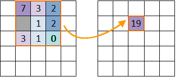
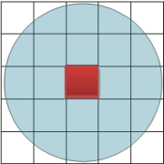
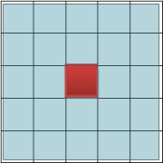
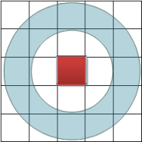
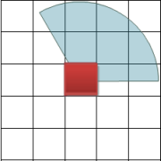

### Introduction

Makes statistics for the cells with in the neighborhood of each cell in a dataset, that is use the cell to calculate as the center to expand certain extent, and calculate based on these raster data, then the result will be used as the value of the cell. The statistics method provided including: Max, Min, Majority, Minority, etc. The types of the neighborhood including rectangle, circle, annulus, sector, etc.

The following picture shows the neighborhood statistics. The value of the cell (row 2, column 3) is determined by the values of the 8 surrounding cells.
  

* **Statistic Mode**: 10 statistic modes are provided:
    * Min: Find the minimum value of the raster cells in the zone.
    * Max: Find the maximum value of the raster cells in the zone.
    * Mean: Calculate the average value of all the cell values in the zone.
    * Standard Deviation: Calculate the standard deviation of all the cell values in the zone.
    * Sum: Calculate the sum of all the cell values in the zone.
    * Variety: Calculate the number of raster cell values in the zone.
    * Domain: Calculate the range of the cell values in the zone, that is the difference of the maximum value and the minimum value.
    * Majority: Find the value that top the rating in the cell values in the zone.
    * Minority: Find the most infrequent value in the cell values in the zone.
    * Median: Sort the cell values in the zone and get the value in the middle.

* **Neighborhood Shape**: Four kinds of neighborhood shapes are provided:
    * Rectangle: The size of the rectangle is determined by the width and height, and all cells in the rectangle participate in this operation. The default values for width and height are 0 (in geographic units or grid units).
    * Circle: The size of the circle neighborhood is determined by the specified radius. All cells in or partially in the circle will participate in this operation. The default radius is 3 (in geographic units or grid units).
    * Annulus: The size of the annulus neighbor is determined by both inner radius and outer radius. All cells in the annulus will participate in the operation. The default inner radius and outer radius are 0 and 6 (in geographic units or grid units). 
    * Sector: The size of the sector neighborhood is determined by radius, start angle, and end angle. All cells within the sector will participate in the operation. The default radius is 3 (in geographic units or grid units), and the default values of start angle and end angle are 0 and 360 degrees.

The following figure shows the four shapes, the default size is 3*3. The cells in the figure are just used for schematic purpose.

|  |   
---|---  
 |  
### Function Entrances

  * Click **Spatial Analysis** > **Raster Analysis** > **Raster Statistics** > **Neighbor Statistics**.
  * **Toolbox** > **Raster Analysis** > **Surface Analysis** > **Raster Statistics**. (iDesktopX) 

### Parameter Description

  * **Source Data** : Select the source data for statistics, including the datasource and dataset that contains the raster data.
  * **Parameter Settings** : Set the parameters for raster statistics, including statistics mode, unit type and neighborhood shape. 
    * Statistics Mode: Select the statistics mode, there are 10 modes, including Min, Max, Mean, Standard Deviation, Sum, Variety, Domain, Majority, Minority and Median.
    * Unit Type: Select the unit type. Two unit types are supported currently, including raster coordinates and GCS. The raster coordinates use the raster data as the neighborhood unit, and the GCS use the unit of the map as the neighborhood unit.
    * Neighborhood Shape: Four shapes are supported: Rectangle, circle, annulus and pie. After selected the shape, you need to set the size of it, for example, set the width and height for rectangle, or set the radius, start angle and end angle for pie.
  * **Ignore NoValue** : Whether to ignore NoValue data. When Ignore NoValue Data is checked, only the cells that have values in the value raster data will be calculated.
  * **Result Data** : Set the result data. Including selecting the datasource and inputting the name of the dataset.
