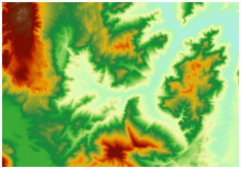
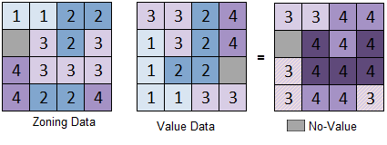

### Introduction

Makes statistics for a dataset (value data, it must be raster data) based on the zonal extent of different types contained in a dataset (zonal data, vector region data or raster data). Divide the raster data based on the zone and calculates statistics for the raster data in the same zone, the cells in the same zone will be assigned the same value, and output to a new raster dataset. For example, calculating the average population density in each polluted area, or the land use type in each zone with the same slope. The following figures use the slope classification raster as the zonal data, and the elevation data as the value data to calculate the average elevation value in the same slope zone.

SuperMap provides 10 statistics modes, including:
  * Min: Find the minimum value of the raster cells in the zone.
  * Max: Find the maximum value of the raster cells in the zone.
  * Mean: Calculate the average value of all the cell values in the zone.
  * Standard Deviation: Calculate the standard deviation of all the cell values in the zone.
  * Sum: Calculate the sum of all the cell values in the zone.
  * Variety: Calculate the number of raster cell values in the zone.
  * Domain: Calculate the range of the cell values in the zone, that is the difference of the maximum value and the minimum value.
  * Majority: Find the value that top the rating in the cell values in the zone.
  * Minority: Find the most infrequent value in the cell values in the zone.
  * Median: Sort the cell values in the zone and get the value in the middle.

When checked the Ignore NoValue Data option, the zonal data without value will not be calculated. The figure below shows the statistics for two raster zones, the Statistic Mode is Max. The Ignore NoValue Data option is checked, you can see that the NoValue data in the value dataset is ignored, but the NoValue data in the zonal data is calculated.  

  

###  Function Entrances

  * **Spatial Analysis** > **Raster Analysis** > **Raster Statistics** > **Zonal Statistics**.
  * **Toolbox** > **Raster Analysis** > **Raster Statistics** > **Zonal Statistics**. (iDesktopX) 

### Basic Steps

  * **Value Data** : Select the value data for statistics, including the datasource and dataset that contains the raster data.
  * **Zonal Data** : Select the zonal data for statistics. The zonal data can be vector region dataset or raster dataset. Currently, only raster datasets in pixel format UBit1, UBit4, UBit8 or UBit16 are supported. 
  * **Statistics Field** : Select zonal field. The field used to identify the zone in the raster zonal dataset. Only 32-bit integer data is supported. The SMID field of the vector dataset is used by default. Raster dataset does not support this field.
  * **Statistics Mode** : Select the statistics mode, there are 10 modes, including Min, Max, Mean, Standard Deviation, Sum, Variety, Domain, Majority, Minority and Median.
  * **Whether to ingore NoValue data** : when Ingore NoValue Data is checked, only the cells that have values in the value raster data will be calculated.
  * **Result data** : The result will be output to a raster dataset. It is needed to set the datasource to save the result data, the name of the raster data and the tabular. Note that the names of the raster result data and the tabular cannot be the same.

### Note

About the statistics result:

**Result Raster**: The raster with the same color represents a zone. Assign the result of this region to all the cells in the zone. If the statistics mode selected is mean, the raster value in the result will represent the average value of all the cells.

**Result Tabular**: Save the statistics result in the zone according to the statistics field. The tabular contains the results of all the statistics modes (Min, Max, Mean, Standard Deviation, etc.) and the number of cells in the zone (PixelCount).
