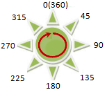
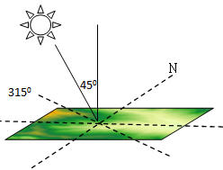

There are 2 types of common hillshade maps:

1. Orthoimage

2. Hillshade

### Orthoimage

Orthoimages made from DEM data have certain visual 3D terrain effects, which can express the geography to help users to learn the characteristics of mountainous areas. Overlaying other thematic maps, we can perform varoius spatail analyses to get more valuable information.

According to the specified color table and the color of NoValue, an orthoimage can be made by rendering DEM brightness values which are obtained by computing the brightness of each points through the changes of grid altitudes.

  
  
### Hillshade

The hillshade feature is used to generate the hillshade map by considering the angle and shadow of the light source on the raster surface. Hillshade is a raster map that simulates the shadow of the practical surface so as to show ups-and-downs of the terrain. By using an imaginary light source to shine the map and the aspect and slope information generated from the raster data, you can get the grayscale value of each cell. The hill facing the light has higher grayscale value, while the hill back to the light has lower gray value which is called the shaded area. This mountain shadow map generated from raster calculation has a very realistic 3D effect, so it is also called hillshade.

Hillshade is mainly used for display. If you overlay the raster map (Figure: 3) with the hillshade map (Figure: 4), and after that, set the transparency of the raster layer, then you can easily create a beautifully fine 3D geomorphological map (Figure: 5). You need to constantly adjust the parameters for different application scenarios in order to achieve the best effect for the mapping such as the transparency and brightness of the raster layer. Then you can continue to add other layers on it such as the maps of land use, road and river so as to further enrich the map information.

  
  
When generating the hillshade map, you need to specify the location of the imaginary light source which is determined by the azimuth and altitude angle of the light source.

* Azimuth is used to determine the direction of the light source, which is denoted by degree. As shown in the figure below, the azimuth is clockwise measured with the due north (0 degrees) as the reference direction, which is assigned the value from 0 degrees to 360 degrees, so the due north is also 360 degrees. The due east is 90 degrees, the due north is 180 degrees, and the due west is 270 degrees. The default value of the azimuth is 315 degrees.

  

* Altitude angle is the angle of inclination of the light source, whose value range is from 0 degrees to 90 degrees. As shown in the figure below, when the altitude angle is 90 degrees, the light source vertically shines the earth surface. The default value of the altitude angle is 45 degrees.

  

The azimuth of the light source is 315 degrees and the altitude angle is 45 degrees, its location relative to the earth surface is showed in the figure below.

  
  
### Related Topics

[Create 3D OrthoImage](OrthoImage)

[Create 3D HillShade](HillShade)
