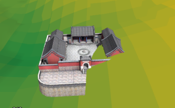
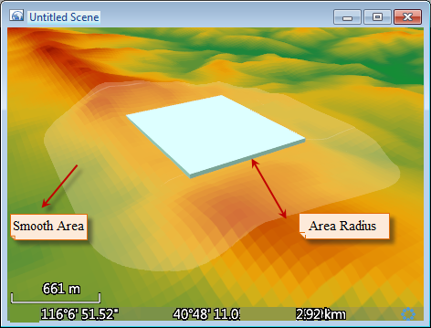

**Overview of Terrain Model Matching**

Add the DEM grid data (terrain data) to the scene and the terrain will be displayed rugged. The model with terrain data will construct the real scene. Because of the topographic relief, there is a problem: the model bottom is smooth and in the same height. But the terrain is ups and downs, the model and terrain can't fit well. Part of the model will be buried or floated in the terrain, which can't reach the real effects. As shown in figure 1, it is the display effect that the model data overlays with the terrain.

The affixed to ground for the three-dimensional scene mode can fit the terrain model fit, but it still can not avoid the model partially buried. Terrain matching is used to solve such problem. It modifies the terrain area covered by the model to a plane, so that the bottom of the model can be affixed to the ground. The following figure 2 is the overlay display of the terrain model match.

 
  
**Process of Terrain Model Matching**

The process of terrain model matching to data contains cut and fill and smooth. Currently, it supports the CAD model data and region data, and process multiple models.

The process of terrain model matching is shown as below:

  1. The application cut or fill for the cover terrain area according to the elevation of model bottom, which stays the terrain elevation and model bottom elevation the same. At this time, it will form a planar in the terrain surface coverage by the model.
  2. The result of matching will lead to the result that the terrain in model increases or decreases suddenly, so it needs to smooth transition processing to the joint section between model and terrain. Take the model bottom plane as reference, a buffer region with R radius (R is the radius of transition region) will be created around the corresponding terrain area. This region needs to smooth. As shown in figure 3, blue represents the model objects, and the transparent is the transition region, and the double-headed arrow is the radius of transition region.

  

Here it refers to the key parameters of terrain model matching.

   * Radius of transition region: The radius of region that needs to be operated. The range of this region starts from the border corresponded to the model, and the radius of transition region is the buffer radius.
   * Smooth Coefficient: It is the key to influence the buffer effects of transition region and is similar to the power of a power function. The effects is better when the value is in [0,3]. It not only keeps the original landform features but also conducts smooth in a certain degree, which transits the model and terrain naturally. When the value is 0, represent no smooth to the transition region of model.

**Determine the bottom elevation of model.**

It supports two model data: the CAD datasets and vector region datasets. For the CAD dataset, the method will directly match the model with the terrain. For the region dataset, in fact, the bottom of the model or the area covered by the model is stretched to a vector region to match with the terrain model. When matching the terrain model, the covered area will be cut and filled based on the bottom of the model or the region elevation. So the bottom or region elevation must be specified:

* When the model is the CAD dataset, the elevation of matched model coverage is determined by the terrain elevation corresponding to the center point of model BoundingBox. The elevation field is unavailable. 
* When the model is vector region dataset, select an attribute field as the elevation of region object. When the attribute in the elevation field is valid, the application will calculate the bounding box center of the region object. Take the elevation corresponding to terrain grid cell as the matching elevation. 

### Related Topics

[Terrain Model Matching](TerrainMatch)
