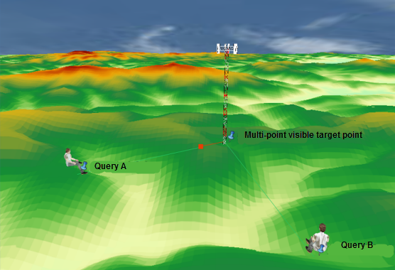

The surface analysis functions of SuperMap obtain information or generated
surface based on surface model. The functions include:

  1. Extracting Isolines
  2. Extracting Isoregions
  3. Visibility Analysis
  4. Slope And Aspect
  5. Cut And Fill

### Extracting Isolines

Isoline is the mostly-commonly used method to represent a surface on a map. An isoline is a smooth curve formed by connecting adjacent points with the same values. Commonly-used isolines include: contours, depth contours, isotherms, isobars, and isohyet lines.

The distribution of isolines reflects the change in the values on a surface. A dense isoline distribution indicates a dramatic change in the values on the surface. For example, a dense contour distribution indicates a steep slope. A sparse isoline distribution indicates a mild change in the values on the surface. For example, a sparse contour distribution indicates a gentle slope. Therefore, locations with the same elevations, temperatures, precipitations, etc., can be found through isoline extraction. At the same time, the distribution of isolines also reflects the steep and flat areas of change.

**Important Concepts**

* **Base Value and Interval**

The base value is the start value for generating contours. It is not necessarily the smallest contour value.

The interval is the difference between the values of two adjacent isolines. The reference value and it both decide to extract which isolines.

These two parameters can be used to determine the values and counts of isolines to be extracted. For example, if the base value is 0 and the interval is 50, for a DEM grid dataset with values ranging from 120-999, 17 isolines would be extracted with minimum value of 150 and the maximum value of 950.

* **Smoothing Factor and Smooth Method**

The generation of an isoline is a process of interpolating the original grid data and then connecting the points with the same values. The result would be angular polylines. Thus the lines need to be smoothed to realistically simulate true isolines. The user can smooth the generated isolines using different smooth methods and smoothing factors.

The range of the smoothing factor is [0, 5]. 0 or 1 indicates that no smoothing is applied. The greater this value is, the smoother the result will be. The recommended value is 3.

SuperMap provides two methods to smooth isolines: B Spline and Polish. In both methods, the extracted isolines are smoother when the smoothing factor is greater. Of course a greater smoothing factor would cost more computation time and occupy more memory.

SuperMap supports surface analyses on grid datasets for isoline extraction. Three methods are provided to extract isolines in surface analyses: Extract All Isolines, Specified Isolines, and Isolines from Click.

  * [Extract All Isolines](DriveContourAll) All the isolines that meet the condition are extracted from a surface model according to specified parameters. Usually Base Value and Interval are used to control the extracted isolines.
  * [Specified Isolines](DriveContourSpecific) A certain number of isolines with specific values are extracted as needed. The user can either directly input the isoline values or automatically generate a series of altitudes according to a specified range and interval.
  * [Isolines from Click](DriveContourPoint) Isolines are selected from the surface model by the user interactively. The output result would be the isolines with altitudes equal to the selected point. Note that they are not only the isolines that pass the selected point.

  

### Extracting Isregions

The isoregion is produced by closing the two neighboring isolines. The isoregion can display the change of the neighboring isolines. The isoregion has the same effect when representing the distribution of the surface. The areas where the isoregions are dense indicate the values here rise or fall rapidly; the areas where the isoregions are sparse indicate the values seldom change. Other, if the isoregion is narrower, the values here change sharply; if the isoregion is wider, the values change gently.

SuperMap surface analysis supports two methods to extract isoregions: Extract All Isoregions; Specified Isoregions.

  * [Extract All Isoregions](DriveRegionAll) All the isoregions satisfying the condition are extracted from a surface model according to specified parameters. Usually Base Value and Interval are used to control the extracted isoregions. The base value is the start value for generating isoregions, and the interval is the difference between the values of two adjacent isolines. These two parameters can be used to determine the values and counts of isoregions to be extracted. For example, if the base value is 0 and the interval is 50, for a DEM grid dataset with values ranging from 120-999, 16 isoregions would be extracted with the minimum value of 150 and the maximum value of 950. To generate isoregions, the original grid data is first interpolated, and the points with the same values are then connected, and finally adjacent isolines are closed to form isoregions. The result would be angular polygons. Thus the polygons need to be smoothed to realistically simulate true isoregions. The smooth methods for isoregions are the same as those for isolines. SuperMap also supports two smooth methods: B Spline and Polish
  * [Specified Isoregions](DriveRegionSpecific) A certain number of isoregions with specific values are extracted as needed. The user can either directly input specific values or let the system automatically generate a series of altitudes according to a specified range and interval.

  

### Visibility Analysis

Visibility analysis, also known as sight map analysis, is in fact an optimization method regarding terrain. Visibility analysis has important application values in fields such as navigation, aviation, and military. For example, it can be used to set a radar station or a TV transmitter station, to select a road, to assist with maritime navigation, and so on. In the military field, it can help lay out bases, set observation posts, lay out communication wires, etc. The analysis can also produce invisible areas which would also be useful in some cases. For example, when a low-altitude reconnaissance aircraft is flying, it needs to avoid enemy's radars, meaning that it needs to fly in the blind zones of the radars. Visibility analysis has two basic aspects: one is visibility analysis on two or more points; the other is viewshed analysis which finds the visible areas for given observation points.

[**Viewshed Analysis**](ViewShedAnalyst)

Viewshed is the visible extent on a terrain surface to one or more observation points. Viewshed analysis is a process of finding the areas visible to a given observer point within a given extent on a grid dataset. The observer point has a relative altitude value. In other words, it is a process of finding the extent of visible areas to a given point. The analysis result is a grid dataset. Viewshed analysis is useful when selecting a site for a transmitting tower, determining the scope of radar scanning, and building forest fire lookout towers.

When performing a viewshed analysis, the user needs to specify a few important parameters, including Observer Point, Added Altitude, View Radius, and View Angle.

  * **Observer Points** : An observer point is an origin point for a viewshed analysis. There can be one or more observer points. When there are multiple observer points, the visible areas for each point can also be determined.
  * **Added Altitude** : The altitude of an observer point consists of two parts: the surface altitude of the point, and the added altitude. Therefore the altitude of an observer point can be adjusted by using added altitude. For example, if the actual surface altitude at the observer point is 430 m and the added altitude is 100 m, the altitude of the point would be 530 m.
  * **View Radius:** View radius limits the searching extent for finding viewsheds. If the visible areas of observer points are to be limited to a certain extent, a view radius can be used for that purpose. When a view radius is applied, the visible areas will only be searched for within the circle with a radius equal to the view radius and centered at the observer point. The default view radius is 0, indicating that the observation radius is infinite, and the entire map extent will be searched for visible areas.
  * **View Angle** : View angle restricts the direction to search for the viewshed. The unit is degree, and the range is 0~360. The default start angle is 0 degree, representing the north direction. It increases to 360 degrees as it rotates clockwise. 

SuperMap supports viewshed analyses for single or multiple observer points. An observer point can be added through clicking the mouse, or through loading a dataset. Selected observer points on a map can also be exported as a point dataset.

**Multi-Point Viewshed Analysis**

Multi-Point viewshed analysis is a process of finding the areas visible to given observer points within a given extent on a grid data surface. Each observer point has a relative altitude. In other words, it is a process of finding all the areas visible to given points. The analysis result is a grid dataset. A multi-Point viewshed can be a common viewshed (the intersection of the viewsheds of all the observer points) or a non-common viewshed (the union of the viewsheds of all the observer points).

Added altitudes can be applied to one or more observation points in a multi-point viewshed analysis. The result may be quite different after added altitudes are applied. Therefore it is very important to check the observer altitudes and apply added altitudes.

For a multi-point viewshed analysis, observer points can be determined through clicking the mouse on multiple points, or through importing a point dataset. The imported point dataset can have an altitude value, or the added altitudes can be set uniformly.

Below is an example of a multi-point viewshed analysis result:

 
  
[**Visibility Analysis**](ViewAnalyst)

A visibility analysis finds out whether a given observer point and a given observed point are visible to each other on an input surface. SuperMap surface analysis provides 2-Point visibility analysis and multi-point visibility analysis according to the number of observer points.

  * [2-Point](TwoObserverVisibility) Determines whether two points on the terrain surface are visible to each other. 

Because the elevations at points on the earth surface simulated by a DEM do not account for the heights of surface objects, such as the heights of trees in forests and buildings, the heights of surface objects could have a significant impact on the analysis result. "Added altitudes" can be used to adjust observer point altitudes to get a more accurate result. If an added altitude is input, it is added to both points. It is possible that the result with added altitude applied is the opposite of that without added altitude applied. For instance, two points are not visible to each other when no added altitude is applied, but they are visible to each other after added altitude is applied. Therefore, it could be vital to know about the heights of surface objects and apply added altitudes. A 2-point visibility analysis can be done by directly drawing a line segment connecting the two points on a grid map, or by analyzing the visibility between the two end points of a line segment in a line dataset overlaying on a grid map.

  * [Multi-Point](MutilObserverVisibility) Determines whether multiple points on a surface are visible to each other. 

Added altitudes can be applied to one or more observation points in a multipoint visibility analysis. The result may be the opposite after added altitudes are applied. Therefore it is very important to check the heights of the surface objects and apply added altitudes.

For a multi-point visibility analysis, points in the analysis can be determined through clicking the mouse on multiple points, or through importing a point dataset.

 
  
3D spatial analysis functions are enhanced 2D spatial analysis functions. They are more intuitive and straightforward. Below is an example of a multi-point visibility analysis displayed in a scene.

  
  

### Slope And Aspect

Slope and Aspect are two important terrain factors, playing an important role on terrain surface analysis, in which slope denotes the measurement of the ratio of height change of a certain location on the earth surface, and the direction of slope change is aspect denoting the measurement of change of slope direction of a certain location on the earth surface.

[**Slope Analysis**](Slope)

When building a house on a mountain, we need to find a much flatter area; when building a ski resort on a mountain, we need to select different slopes separately as the basic ski trail, the medium ski trail, and the advanced trial to satisfy the distinct levels of skiing lovers; when the airplanes involved in emergency rescue are landing, we need to find a much flatter area on the ground. In addition, in the provisions of farmland slope rating, 250 is the limited slopes of farming which means the farmland slopes over 250 can not be farming. All of these situations need to consider the terrain slopes.

The slope of a point on the ground surface denotes the amount of the tilt degree of the point, which is a vector with both size and direction. In terrain analysis, the slope represents the included angle of the tangent plane and horizontal plane across a certain ground point. According to slope maps, we can learned the steepness of the terrain of each position in the region. In the slope maps, every cell has a slope value, the bigger the value, the steeper the terrain; on the contrary, the smaller the value, the flatter the terrain.

The slope can be expressed by degrees or percentages, in which Degree Slope is the arctan value of the ratio of vertical increment and the horizontal increment, and Percentage Slope is the ratio between vertical increment and the horizontal increment multiplied by 100. In Supermap, slope calculation provides three ways to denote including degrees, radians and percentages. To set the slope of the vertical increment as H, the horizontal increment as L, then the angle in degree is θ=arctan(H/L), in radian:R = θ*π/180, in percentage: P= (H/L)*100, as the following figure shows.

  
  
The analysis results of Degree Slope ranges from 0 to 90 degree. 0 denotes the ground surface is horizontal, 90 degree denotes the ground is the steep surface perpendicular to the horizontal plane. The range of the analysis results of Percentage Slope is 0 to infinity, when the result is less than 1, indicating that the altitude increment is less than the horizontal increment where the slope is pretty gentler; when the result is equal to 1, indicating that the altitude increment equals to horizontal increment where the slope degree is 450; when the result is greater than 1, indicating the altitude increment is larger than the horizontal increment where the slope becomes steeper.

The pixel value of the grid dataset is the value of the center point, when calculating the slope and aspect, the elevation of each point can be obtained by interpolation, and then calculate the slope and aspect of each point. Because to calculate the slope and aspect of point is no practical significance, the method calculates the mean value of the slope of each pixel plane in a raster dataset.

  

[**Aspect Analysis**](Aspect)

The aspect analysis has important implications in fields like plant analysis and environmental assessment. In biology, the plant on the north slope of a mountain is dramatically different from the ones on the south side. The difference is mainly because the sunny situations required by the plants are various. When building wind power station, it is necessary to build them on the slope face to wind. Geologist always want to know about the slope of the fault or the outcrop fold to analyze the change process of the geology. When locating the residential area that may be destroyed by the snow melt water, it is needed to identify the location of the south slope to get the location where the snow melt first.

The aspect of one point on a surface is the aspect of the slope at that point. In terrain analysis, aspect is the angle between the the projection of the normal of the tangent plane at the point and the due north direction. The aspect is the direction that has the maximum the elevation change.

Aspect is represented in degrees, the range of aspect analysis result is 0 to 360. Starts form due north 0?and moves clockwise and ends at 360? The value of each cell in the aspect map represents the direction of slope, flat slope has no direction and the value is -1.

  
  
Since the measurement of aspect forms a circle, 10?is closer to 360?than 30? So you need to convert the aspect before the analysis, and divide aspect in to four basic directions: East, West, South and North (or eight basic directions: East, West, South, North, Southeast, Southwest, Northeast and Northwest). The conversion can be done with the raster reclassify functionality, note the range of the aspect.

  

### Cut And Fill

[**Cut And Fill**](CutFill)

The objects on a surface may move because of deposition and erosion, the result is the increasing of surface objects at some region and the reducing of surface objects at other region. In project, the reducing of surface objects is called Cut and the increasing of surface objects is called Fill. The following is a sketch map of cut and fill.

  
  
A grid cut and fill calculation requires two input grid datasets: the dataset before a cutting and filling operation and the one after. The value of each cell in the result dataset is the difference between the values of the corresponding cell in the two input datasets. A positive cell value indicates that the surface material at that cell has reduced; a negative cell value indicates the surface material there has increased. The figure below is an illustration of a cut and fill calculation displayed in form of a 4*4 raster data:

  
  
It is clearly shown in this figure: Result dataset = Grid dataset before cutting and filling - Grid dataset after cutting and filling.

The figure below shows the cut result, it lists the source dataset before cut, the dataset used as reference and the result dataset. In the source dataset and the reference dataset, the higher the elevation, the more red the raster color; the lower the elevation, the more green the raster color. In the result dataset, the part need to cut is represented in blackish green, the larger the cut amount, the darker the color; the part do not need to fill and cut is represent in white.

  
  
Since fill and cut is the calculation performed on the corresponding cell of the two input datasets, the two datasets must have the same coordinate and projection system. Theoretically, the spatial range of the two input datasets should be the same, but for two dataset which have different spatial range, only the result in the overlap region will be calculated; if one of the dataset have a null value at certain cell, the result cell will also be null.

The extent of the result dataset is the overlap extent of the two dataset that have different extents.

[**Cut and Fill with Regions**](CutFillRegion)

Cut and Fill with Regions is used to flatten the rolling terrain.

The different with common cut and fill is that Cut and Fill with Regions is performed on raster dataset and specified plane, the plane can be existing vector dataset or region draw with the cursor based on raster dataset; but cut and fill is the calculation between two raster datasets. By comparison, Cut and Fill with Regions has a broader scope of application and more flexible operation.

[**Inverse Cut/Fill**](InverseCutFill)

It is used to calculate the height of a cut/fill volume, given the dataset and the cut/fill volume.

