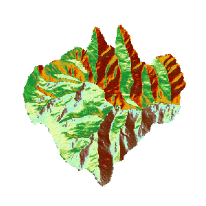

### Introduction

Aspect analysis is used to calculate the aspect of each pixels in grid dataset (Usually use the DEM data). The aspect range is 0 to 360 degrees, which moves clockwise from north 0 degree and ends north 360 degrees. The flat aspect has no direction and it is -1. Please refer to the About Surface Analysis [Slope and Aspect Analysis](AoubtSurfaceAnalyst) for more information about the principle and calculation method of aspect analysis.

**Sample Application**

Open the datasource Terrain in the folder ExerciseData/RasterAnalysis. The datasource includes DEM data with the resolution of 5 meter.

### Functional Entrances

  * Click the **Spatial Analysis** > **Raster Analysis** > **Surface Analysis** > **Aspect Analysis**. 
  * **Toolbox** > **Raster Analysis** > **Surface Analysis** > **Terrain Calculate** > **Aspect Analysis**. (iDesktopX)

### Main Parameters

  * Source Data 
    * **Datasource** : List all the datasources in current workspace and select the datasources that the datasets needed to conduct aspect analysis belong to.
    * **Dataset** : List all the grid datasets in the current datasource. Select the datasets that needs to conduct aspect analysis. Usually we will choose the DEM data with altitude. Here it will locate to the selected datasets in the workspace manager.
  * Result Data 
    * **Datasource** : List all the datasources in current workspace and select the datasource that contains the result datasets. It is the same with source datasource by default.
    * **Dataset** : Set the name of result dataset. The new created aspect dataset is a dataset that has the same size and resolution with the source dataset.

  

### Related Topics

[About Surface Analysis](AoubtSurfaceAnalyst)
