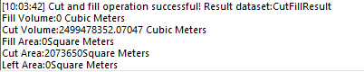

---
id: CutFill
title: Cut and Fill
---  
### Introduction

It is used to describe the volume and area changes between two grid datasets. The "fill" means the increase of surface material and "cut" means the decrease of surface material. The calculation results of the cut and fill is the result that data after cut and fill subtract data before cut and fill. Please refer to the About surface analysis [Surface Cut and Fill](AoubtSurfaceAnalyst) for more information about principles and methods of cut anf fill.

There are a few important points regarding the two input grid datasets and the result dataset:

  1. The two input grid datasets must have the same coordinate system and projection, so that a point on the Earth would have the same coordinates in the two datasets. If the coordinate systems of the two grid datasets are not the same, an erroneous result may be produced.
  2. Theoretically, the spatial extents of the two input grid datasets should be the same. If not, only the overlapped part will participate in the cut and fill calculation.
  3. If a cell in a grid dataset has a null value, the corresponding cell in the result dataset will have a null value too.

### Functional Entrances

  * Click **Spatial Analysis** > **Raster Analysis** > **Surface Analysis** > **Cut Fill**.
  * **Toolbox** > **Raster Analysis** > **Surface Analysis** > **Terrain Calculate** > **Cut Fill**. (iDesktopX)

### Main Parameters

  * Set the grid dataset before cut and fill. 
    * Datasource: List all the datasources in current workspace and select the datasource that the grid dataset belong to before cut and fill.
    * Dataset: List all the grid datasets (GRID) in the current datasource. Select the grid dataset before cut and fill in the list. Here it will locate to the selected datasets in the workspace manager.
  * Set the grid dataset after cut and fill. 
    * Datasource: List all the datasources in current workspace and select the datasource that contains the grid dataset after cut and fill. It is the same with source datasource by default.
    * Dataset: List all the grid datasets (GRID) in the current datasource. Select the grid dataset after cut and fill in the list. 
  * Set the result data. 
    * Datasource: List all the datasources in current workspace and select the datasource that contains the result datasets. It is the same with source datasource by default.
    * Dataset: Set the result dataset name. The result dataset is the subtraction between cut and fill data and source data.
  * Display results in the map: Open the result dataset in the current map window after the operation. The cut is represented by green and the fill is represented by yellow.
  * Display result in the scene: Open the result dataset in the current scene window after the operation. 
  * Click "OK" button to conduct the cut and fill operation. 

After conducted this operation, it will display the cut and fill result in the output window, including the fill volume, cut volume, fill area, cut area, and the no-cut and fill area five contents. The volume unit is cubic meter, and the area unit is square meter, shown as below:

  

### Related Topics

 [Inverse Calculation of Cut/Fill](InverseCutFill)

 [About Surface Analysis](AoubtSurfaceAnalyst)
