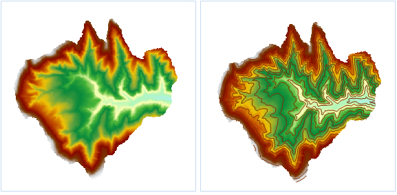

### Instructions

Extract All Isolines is to extract all the isolines satisfying the condition from a surface model according to specified parameters.

  * The source dataset from which isolines are extracted must be a DEM or a Grid dataset.

**Sample Application**

Open the datasource Terrain in the folder ExerciseData/RasterAnalysis. The datasource includes DEM data with the resolution of 5 meter.

### Functional Entrances

  * Click the **Spatial Analysis** > **Raster Analysis** > **Surface Analysis** > **Extract Isolines** > **Extract Isolines**. 
  * **Toolbox** > **Raster Analysis** > **Surface Analysis** > **Extract Isolines** > **Extract Isolines**. (iDesktopX)

### Main Parameters

  * Set the common parameters for an isoline extraction analysis, including the source data, the target data, as well as the resampling factor, smooth method, and smoothing factor in the parameter settings. For details about setting the common parameters such as the source data, the target data, and the parameter settings, please see: [Description of common parameters for isoline/isoregion extraction](CommonPara).
  * Set Datum Value and Interval.

**Datum Value:** it is the start value for generating contours. It calculates from both forward or back with the interval of isoline. So it is not necessarily the smallest contour value. The default value is 0. For example, the DEM data with the elevation range 220-1250, if you set the reference value as 500 and the interval of isoline is 50, so the result is: the minimum isoline is 250 and the maxmum isoline is 1550.

**Interval:** The interval between two isolines. The reference value and it both decide which isolines to extract.

Once the parameter setting is completed, the system will automatically calculate the result and display the result information. Explanation about the result information is as follows:

**Max Cell Value:** The maximum cell value in the selected source dataset. It is system information and cannot be modified.

**Min Cell Value:** The minimum cell value in the selected source dataset. It is system information and cannot be modified.

**Max Isoline:** The maximum isoline value in the target dataset.

**Min Isoline:** The minimum isoline value in the target dataset.

**Count:** The total count of isolines in the target dataset.

  * Click **OK** to complete the isoline extraction operation.
  

### Related Topics

[Introduction to Surface Analysis](AoubtSurfaceAnalyst)

[Specified Isolines](DriveContourSpecific)

[Isolines from Click](DriveContourPoint)
