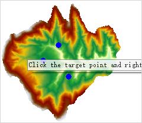
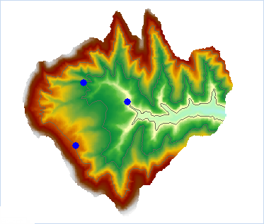

### Instructions

Extracts all the isolines with altitudes equal to the values at the mouse-clicked locations.

  * The source dataset from which isolines are extracted must be a DEM or a Grid dataset.

**Sample Application**

Open the datasource Terrain in the folder ExerciseData/RasterAnalysis. The datasource includes DEM data with the resolution of 5 meter.

### Functional Entrances

  * Click the **Spatial Analysis** > **Raster Analysis** > **Surface Analysis** > **Extract Isolines** > **Extract Isolines by Points**. 
  * **Toolbox** > **Raster Analysis** > **Surface Analysis** > **Extract Isolines** > **Extract Isolines by Points**. (iDesktopX)

###  Main Parameters

  1. Move your mouse on the map, and the mouse will become a cross, click on the map to select one or more points which need to extract the contours:
  
---  
  2. After the selection is completed, right click the mouse to bring out the "Isolines by Point". 
  3. Set required parameters in the dialog box. For details on these parameters, please refer to [Description of common parameters](CommonPara).
  4. Click **OK** to extract isolines. 

  

### Related Topics

[Introduction to Surface Analysis](AoubtSurfaceAnalyst)

[Extract All Isolines](DriveContourAll)

[Specified Isolines](DriveContourSpecific)
