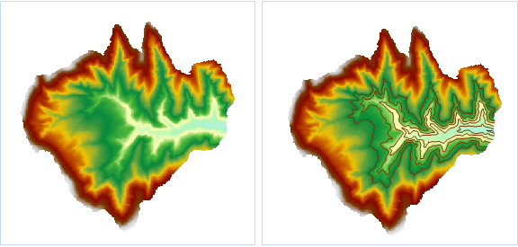

### Instructions

Extract Specified Isolines extracts isolines with specific values as needed. You can enter a specific value directly, or you can automatically generate a series of eigenvalues based on the set range and interval, and you can also import a specific value stored in the * .txt file.

  * The source dataset from which isolines are extracted must be a DEM or a Grid dataset.

**Sample Application**

Open the datasource Terrain in the folder ExerciseData/RasterAnalysis. The datasource includes DEM data with the resolution of 5 meter.

###  Functional Entrances

  * Click the **Spatial Analysis** > **Raster Analysis** > **Surface Analysis** > **Extract Isolines** > **Extract Specified Isolines**. 
  * **Toolbox** > **Raster Analysis** > **Surface Analysis** > **Extract Isolines** > **Extract Specified Isolines**. (iDesktopX)

### Basic Steps

  * In the **Extract Given Isolines** dialog box click the **Batch Add** icon to open the **Batch Add** dialog box where you can set parameters like Start Value, End Value, and so on.

**Start Value:** The start value for generating isolines.

**End Value:** The maximum value in the generated isolines.

**Interval:** The interval of two adjacent isolines.

**Values:** The total count of isolines in the target dataset. Once the interval is set, the system will automatically calculate the value count.

The starting value is set to 1100, the end value is 1200 and the interval value is 20, it represents to extract six contours with a distance of 20 between 1100 and 1200.

  * Set the common parameters for extracting contours, including Source Data, Target Data and Resampling, Smooth Method, Smoothness in the Parameter Settings. About the common parameters settings of source data, target data and parameter settings, please refer to [Common Parameter Description](CommonPara).
  * When extracting specified isolines, isoline information in .txt format can be imported and exported. Also the information about one or all current isolines can be deleted. From left to right, the buttons correspond to Import, Export, Delete, and Delete All function respectively.
  * Click the **OK** button to complete the isoline extraction operation.  

    

### Related Topics

[Introduction to Surface Analysis](AoubtSurfaceAnalyst)

[Extract All Isolines](DriveContourAll)

[Isolines from Click](DriveContourPoint)

