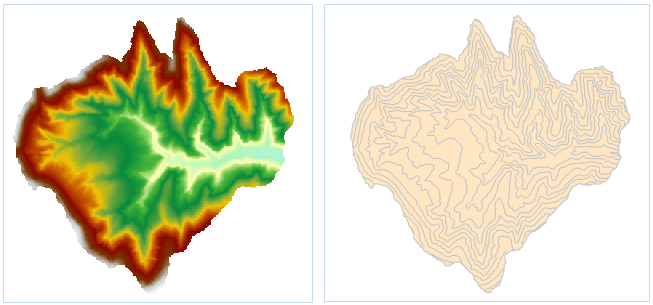

### Instructions

Extracts all isoregions satisfying the condition from a surface model according to specified parameters.

  * The input dataset must be a DEM or a Grid dataset.

**Sample Application**

Open the datasource Terrain in the folder ExerciseData/RasterAnalysis. The datasource includes DEM data with the resolution of 5 meter.

### Functional Entrances

  * Click the **Spatial Analysis** > **Raster Analysis** > **Surface Analysis** > **Extract Isolines** > **Extract Isoregions**. 
  * **Toolbox** > **Raster Analysis** > **Surface Analysis** > **Extract Isolines** > **Extract Isoregions**. (iDesktopX)

### Main Parameters

  * Set the required parameters for an isoregion extraction analysis, including the source data, the target data, as well as the resampling factor, smooth method, and smoothing factor in the parameter settings. For details about setting the common parameters such as the source data, the target data, and the parameter settings, please see: [Description of common parameters](CommonPara).
  * Set Datum Value and Interval.

    * **Datum Value:** The start value for generating isoregions. It calculates from both forward and back with the interval of isoline. So it is not necessarily the smallest isoregion value.
    * **Interval:** The interval of two adjacent isoregions starting from the base value. Its unit is the same as that of the source dataset by default. The reference value and it both decide to extract which isoregions.

  * Once the parameter setting is completed, the system will automatically calculate the result and display the result information. Explanation about the result information is as follows:
    * **Max Cell Value:** The maximum cell value in the selected source dataset. It is system information and cannot be modified.
    * **Min Cell Value:** The minimum cell value in the selected source dataset. It is system information and cannot be modified.
    * **Max Isoregion:** The maximum isoregion value in the target dataset.
    * **Min Isoregion:** The minimum isoregion value in the target dataset.
    * **Count:** The total count of isoregions in the target dataset.

  * Click the **OK** button to complete the isoregion extraction operation.
  

###  Related Topics

[Introduction to Surface Analysis](AoubtSurfaceAnalyst)

[Specified Isoregions](DriveRegionSpecific)
