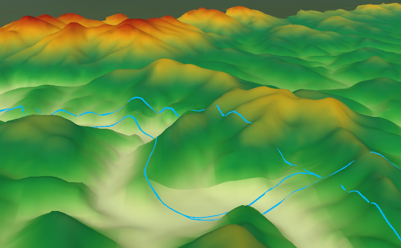

### Instructions

Assign elevations to vector data like 2D points, lines, polygons thereby generate new 3D vector data by extracting Z field (elevation information) of DEM data.

  * The result data contains fields, attributes of 2D dataset and coordinate-Z (elevation information). You can select an object then view its information in the Properties window. 
  * If the result ia a 3D point dataset, a new field Z will be generated in the Properties panel under the Nodes tab, at the same time, a field SmZ will be added into the result attribute table for recording elevations. If you want to view the field, please click "Show Hidden Column".

### Functional Entrances

  * Click the **Spatial Analysis** > **Raster Analysis** > **Surface Analysis** > **Extract Isolines** > **Extract 3D Data**. 
  * **Toolbox** > **Raster Analysis** > **Surface Analysis** > **Extract Isolines** > **Extract 3D Data**. (iDesktopX)

**Note** : Your workspace must include DEM data.

### Main Parameters

The required parameters include:

* **DEM Data:** Elevations of the given DEM raster data will be extracted.

* **2D Vector Data:** Specify a 2D point, line or region dataset.

* **Atitude Zoom Parameter:** In DEM grid data, this value is the unit transformation coefficient that grid value (Z) is relative to X and Y. Usually, in a operation with X, Y and Z, it needs to multiply by a elevation scale coefficient to make the three has the same unit. For example, the unit of X and Y is meter, but Z is feet. So it needs to multiply by 0.3048. the scale coefficient is 0.3048.

* **Interpolation of existing nodes only for:** When extracting elevations of lines or polygons, if you check the box, only elevations of their nodes can be extracted.

* **Interpolation Distance:** Checking the box means the nodes from lines or polygons at corresponding postions based on the given distance. Default value is the resolution of your DEM data.

Specify the result datasource and result dataset and click "OK" to finalize the operation. 

For example, overlay your scene with the generated 3D lines, and specify the Altitude Mode as "Clamp to Ground" in the "Styles" tab, and then the 3D lines will be shown as their elevations.

  

###  Related topics

 [About the Surface Analysis](AoubtSurfaceAnalyst)

 [Extract the specified isoregions](DriveRegionSpecific)
