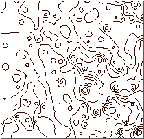

### Introduction

Extracting isolines of point dataset needs to get grid dataset from performing interpolation analysis for the point dataset first, and then connect neighboring points in the grid dataset with the same elevation value to extract isolines with the same elevation values.

SuperMap desktop product supports extracting isolines from 2D point dataset, 3D point collection. 2D point dataset employs a certain field to store property information such as elevation, temperature, etc. for isoline extraction. 3D point collection stores the third dimensional information except for coordinate information of points. The theory of extracting isolines from point data is interpolating point dataset and 3D point collection to get grid dataset for isoline extraction.

Dispersed points in the point dataset can exactly represent the position but they cannot well show other property information. For instance, you have large numbers of sampling points with the elevation information, the distribution of these sampling points is as shown below. You can not see the high and low terrain trend from the left figure. However, if you use the isolines to display the underlying information of these points, namely connecting the neighboring points of equal values and gaining the contours as shown in the 2nd figure below, you will see the information in a more obvious way. Extracting isolines from points is not limit to extracting contours, if the points have the attribute values such as temperature, precipitation, you can generate isolines for temperature, precipitation information or others.

  
  
**Sample Application**

Open the datasource Precipitation in the folder ExerciseData/RasterAnalysis. The datasource includes rainfall data of some areas.

###  Functional Entrances

  * Click the **Spatial Analysis** > **Raster Analysis** > **Surface Analysis** > **Extract Isolines** > **Extract Isolines by Points**. 
  * **Toolbox** > **Raster Analysis** > **Surface Analysis** > **Extract Isolines** > **Extract Isolines by Points**. (iDesktopX)

### Main Parameters

* **Source data**
   - **Datasource** : The datasource where the dataset for isoline extraction is located.
   - **Dataset** : The dataset for isoline extraction. After selecting the datasource for isoline extraction, the system will automatically filter datasets to leave 2D and 3D point datasets.
   - **Field Name** : The attribute field for interpolation analysis. It is often set to elevation field. While extracting isolines, the field will be employed for interpolation analysis on the point data.

* **Result data**

   - **Datasource** : The datasource where the dataset for interpolation analysis is stored.

   - **Dataset** : The name of the result dataset where the isoline extraction result stores. If the dataset name input already exists, a message that tells the datast name is invalid will be presented for you to reenter the dataset name. By default, the dataset name is IsoLine.

   - **Max Isoline** : The maximum value of the isolines in the target dataset.

   - **Min Isoline** : The minimum value of the isolines in the target dataset.

   - **Count** : The total number of isolines in the target dataset.

* **Parameter Settings**
   - Interpolation Type: If the source dataset is 3D point dataset, IDW, Kriging, or TIN can be employed for interpolation.
     * IDW estimates the value of the cell by calculating the average value of discrete point group in the neighboring area, it is a simple and effective data interpolation method, and the computing speed is fast.
     * The idea of the Kriging method is the same with ordinary kriging interpolation method, the data structure is simple, very suitable for the construction of large area macro topography.
     * The TIN method creates a TIN model with the given line dataset, then create terrain with the given extreme point information (optional), and lake information (optional). TIN model can reflect the terrain features, but the data structure is complex, and it is suitable for small area terrain calculating.
   - Resolution: The resolution of he intermediate result (grid dataset) for point dataset. If the interpolation type is TIN, the resolution is not necessary to be specified.
   - Datum Value: The initiation value for isoline extraction, which may not be the minimum isoline value. You can input any number as the datum value. The default value is 0.
   - Interval: Interval is the interval value of the two isolines. Interval and Datum Value determines the isolines to extract.
* Set parameters like Resample Coefficient, Smooth Method, Smoothness Coefficient, etc. Please refer to [Introduction to Common Parameters](CommonPara) for details settings on common parameters.
* Click **OK** to finish the isoline extraction. You can check the resulting isolines by opening it in the map window, as shown below:
  

###  Related Topics

 [About Surface Analysis](AoubtSurfaceAnalyst)

 [Extract All Isolines](DriveContourAll)

 [Extract Given Isolines](DriveContourSpecific)

 [Extract Isolines from Point Data](DriveContourPoint)
