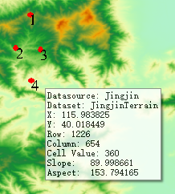
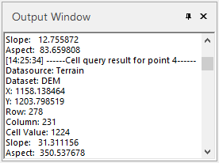

### Introduction

Find the cell value at the location of the cursor. The query default result will display the datasource, dataset, x coordinate, y coordinate, row, column, cell value, slope and aspect. The Raster Query feature can be operated on the mosaic dataset.

### Functional Entrance

  * Click the **Spatial Analysis** > **Raster Analysis** > **Raster Query**. 

### Operating Instructions

  * If you move your mouse over a grid layer, an information text appears followed by the mouse. In this text, the datasource, dataset, x,y coordinates, row&column, and value are listed.

  
 
* Click the drop-down button and select Set Grid Value Query to open the Grid Query Parameter Settings dialog. In the dialog box set whether to display the raster information, slope and aspect value, etc.
    * **Display Grid Information** : check this box to enable the application to display information on the located raster column and raster row, and raster value of the pixel where your mouse hovers. 
    * **Display Slope and Aspect** : check the box to allow the application to display the slope and aspect values of the pixel where your mouse hovers.
    * **Z Factor** : When the unit of the raster value (it is also called elevation) is different from the one of coordinate X or Y, you can set a scaling coefficient to make their units the same. For example, to switch feet to meters, you can set the scaling coefficient to 0.3048. 

It is recommended that your data uses a projection coordinate system (unit: meter). But if the units of the coordinate X and Y are latitude and longitude while the unit of the elevation is meter, you can choose an appropriate Z factor from the following table.

        
                
           **Latitude**     **Z-factor**
               0         0.00000898
              10         0.00000912
              20         0.00000956
              30         0.00001036
              40         0.00001171
              50         0.00001395
              60         0.00001792
              70         0.00002619
              80         0.00005156
        
        

* If you click a point on the grid layer, this point will be highlighted. Meanwhile, a Output window pops up, listing such information as datasource, dataset, coordinates, value, etc.

  

  * Press ESC or right click your mouse to cancel the query. Hold the ESC key can clear all highlighted raster points from the map window.

### Related Topics

 [Grid Query Settings](FindRasterVauleSetting)

 [Introduction to Surface Analysis](AoubtSurfaceAnalyst)
