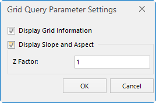

### Introduction

Set whether to display grid information, slope and aspect, when showing the grid value; Z factor is also set here.

### Basic Steps

  1. In the Raster Analysis group of the Spatial Analysis tab, click the Grid Value button, and select Set Grid Value Query.
  
  

The Grid Query Parameter Settings dialog box  
  - Display Grid Information: When this option is checked, the column and row number, and raster value info will be displayed as well when you mouse over each grid pixel. Otherwise, not.
  - Display Slope and Aspect: When this option is checked, the slope and aspect will be displayed as well when you mouse over each grid pixel. Otherwise, not.
  - The specified elevation factor (the coefficient for transforming Z values to values with X and Y units in a Grid). For a calculation involving X, Y, and Z values, usually a zFactor needs to be set to make their units consistent. For example, X and Y units are meters, and Z unit is feet. One feet is equal to 0.3048 meter, so the specified zFacor is 0.3048. If you set it as 1.0, then it will not zoom. 

It is recommend that the analysis data is in a projection coordinate system (unit: meter). If you use geographic coordinate systems, you need to set a proper Z factor for the latitude. Below is a reference if you are using degrees for x, y and meters for z:

        
       **Latitude**     **Z-factor**
           0         0.00000898
          10         0.00000912
          20         0.00000956
          30         0.00001036
          40         0.00001171
          50         0.00001395
          60         0.00001792
          70         0.00002619
          80         0.00005156
    
    

 2. Click OK to finish the settings.

###  Related Topics

 [Grid Query Settings](FindRasterVaule)

 [About Surface Analysis](AoubtSurfaceAnalyst)
