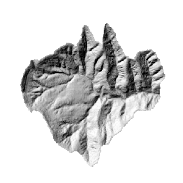

### Instructions

The hillshade function is to get the assumed surface illuminance by determining every cell's illuminance of the raster surface. The assumed illuminance can be gotten by setting the assumed light source and calculating each cell's illuminance value. The hillshade can greatly improve the 3D display effect of the raster surface. For more information about hillshade, see [Hillshade](AboutHillShade).

**Sample Application**

Open the datasource Terrain in the folder ExerciseData/RasterAnalysis. The datasource includes DEM data with the resolution of 5 meter.

### Functional Entrances

  * Click the **Spatial Analysis** > **Raster Analysis** > **Surface Analysis** > **Terrain Calculate** > **3D Hillshade Map**. 
  * **Toolbox** > **Raster Analysis** > **Surface Analysis** > **Terrain Calculate** > **3D Hillshade Map**. (iDesktopX)

### Main Parameters

**Light source parameter settings**

  * **Azimuth** : The azimuth is denoted by a positive degree within [0,360]. It is clockwise measured with the north as the reference direction. 
  * **Altitude Angle**: The altitude angle above the horizon. It is denoted by a positive degree, 0 degree denotes the horizon, and 90 degree denotes the positive direction above the head.

**Parameter Settings**

  * **Shadow Mode** : There are three modes supported, including Render&Shadow, Shadow, and Render. 
    * **Render &Shadow**: Takes both the azimuth and shadow into consideration. 
    * **Shadow** : Takes only shadow into consideration. That is whether the current area is within the shadow. 
    * **Render** : Only considers the azimuth of current position. 
  * **Z Factor** : The coefficient transforming the elevation unit of the raster surface (Z value) into X and Y units. When Z unit is different from X and Y units, the Z factor can be used to adjust. 
    * If Z unit is identical to X and Y units, then the Z factor is 1 which denotes no scaling.
    * If Z unit is different from X and Y units, then you must use a suitable Z factor, otherwise you may get a wrong result. For example, X and Y units are meter, whereas Z unit is feet, as 1 feet = 0.3048 meter, then you need to make the Z factor is 0.3048 so as to convert the feet into meter. 

**Result Data**

  * **Datasource** : Lists all the datasources in the current workspace; selects the datasource which the result dataset exists in. It is same with the datasource of the source dataset by default.
  * **Dataset** : Sets the name of the result dataset. A new generated rendering dataset has the same size and resolution with the source dataset.

Click **OK** to execute the operation.

  
  
###  Related Topics

 [3D Hillshade](AboutHillShade)

