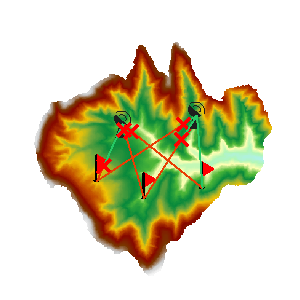

### Instructions

A multi-point visibility analysis is a process of finding out whether each two of multiple observer points and observed points are visible to each other on an input grid data surface.

  * Visibility analysis can be applied only when a Grid/DEM dataset exists in the current map window.
  * Added altitude is a component of the total altitude of an observer point. It has important impact on the visibility analysis result. Thus it is important to know about the surface altitude at the observer point and the added altitude in order to make the analysis result more realistic.
  * When there are multiple observer points, the visibility between each two of the observer points will be analyzed.

**Sample Application**

Open the datasource Terrain in the folder ExerciseData/RasterAnalysis. The datasource includes DEM data with the resolution of 5 meter.

### Functional Entrances

  * Click the **Spatial Analysis** > **Raster Analysis** > **Surface Analysis** > **Multi-point Visibility**. 

###  Main Parameters

  * Specify the current layer for the analysis. If there are multiple grid layers in the current map window, it needs to be specified here which layer is to be used in the visibility analysis.
  * Specify the observation points. They can be added by clicking the mouse, or by directly importing a point dataset. Or, you can import observation points with the Import tool in the toolbar. The toolbar organizes a series of tools.
    * **Import** button: Used to import the points of the point dataset as the observation points and observed points to analyze. The dataset must include Append field and Role field. Click Import button and show up the Import dialog box. Set the related parameters in the dialog box. 
    * **Export** button: Export the points added in the current map window as point datasets, save the append information and the role information into the attribute table. Click Export, and the Export dialog box is displayed. You can set the related information in the dialog.
    * **Set** button: When one or more records are selected in the dialog box, click the button to pop up the Batch Parameter Settings dialog box to set the the selected record parameter information, including Append and Role.
  * Set the added altitudes of the observer points. The added altitudes can be modified individually or together. 
  * Set the roles of the observer points. At least one point is the Observer Point, and another is the Observed Point.
  * Set parameters for saving the obstruction points. The obstruction points are saved as a dataset, the datasource and the name of the input dataset need to be selected.
  * Save the analysis result. Set whether to display all the visible points and non-visible points in the map window. Checking "Save details" will retrieve detailed analysis result and output it to a text file.
  * Click the "OK" button to implement the visibility analysis operation.

  

###  Related Topics

 [Introduction to Surface Analysis](AoubtSurfaceAnalyst)
