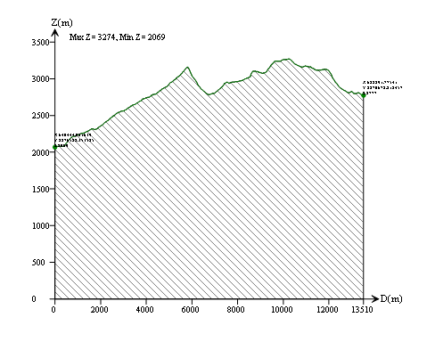
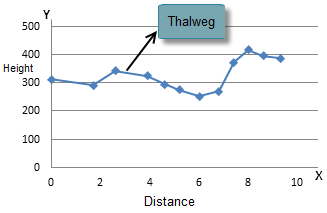

### Introduction

Profile shows the change of elevation along the line (section). The research of the profile, terrain, geology and hydrology features of certain section, including the landform, outline, absolute and relative elevation, geologic structure, slope features, surface cutting strength, erosion, etc., is very useful for the estimating of the feasibility for building railway or the difficult for building road, it can also provide foundation for calculating earth volume.

As shown below, perform the profile analysis for the raster surface, and get the profile line and profile picture.

The Profile Analysis functionality in SuperMap is use to create the profile along a given line and get the sampling points.

**Sampling Points**

The raster surface is continuous, and it is impossible to get all the locations on the given path, so it is needed to select some feature points from the path, called sampling points. The profile is formed by the elevation and coordinate information of the points. In the figure below, the intersections of the given path and the center lines of the cells are used as sampling points.

  
  
**Profile line and profile sampling points**

Profile line is one result of the profile analysis, it is a polygonal line. The nodes on the line and the sampling points are in one-to-one correspondence with the sampling points, the X value of the node represents the straight-line distance between the current sampling point to the start point of the given path, and the Y value is the elevation of the sampling point. In the coordinate system, the maximum and minimum values of the elevation of all the nodes is labeled on the top left corner, the x-coordinates, y-coordinates and elevation values of all the nodes are labeled on the profile line. The sampling points have the location of all the points, and the profile line stores the points. You can get the elevation of certain location and its distance to the start point from the profile line and sampling points.

  
  
The figure below shows the profile line in the 2D coordinate system, the ups and downs of the terrain on the line is displayed intuitively.

  
  
###  Functional Entrances

* Click the **Spatial Analysis** > **Raster Analysis** > **Surface Analysis** > **Profile**. 
* **Toolbox** > **Raster Analysis** > **Surface Analysis** > **Terrain Calculate** > **Profile**. (iDesktopX)

###  Main Parameters

  * Set the source data for profile analysis. Select the datasource and the dataset that contains the raster data for profile analysis.
  * Set the path data. Select the datasource and the line dataset that contains the path data. Create profile line data and sampling point data for each line object; if there are more than one line object in the line dataset, multiple profile data and sampling point data will be created.
  * Set the result data. Select the datasource to save the profile line (CAD dataset) created, and input the name of the profile line data.
  * Whether to create the sampling point dataset. If Create Profile Sampling Data is checked, the profile sampling point dataset will be created when creating the profile line.
  * After the operation is successfully made, you can double click the result CAD dataset and check the profile.
