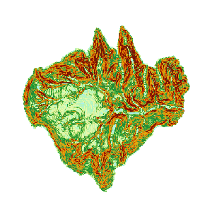

### Introduction

Slope analysis is used to calculate the slope of each pixel in grid dataset (Usually use the DEM data). The larger the slope value is, the abrupter the terrain; the smaller the the slope value is, the flatter the terrain is.

The pixel value is the altitude value of this point in DEM data. The slope of this point is calculated by the altitude. The slope is the average of every pixel plane in SuperMap. and SuperMap provides three slope format: degree, radian and percentage. Please refer to the About Surface Analysis [Slope and Aspect Analysis](AoubtSurfaceAnalyst) for more information about the principle and calculation method of slope analysis.

**Note** : Data in the geographic coordinate system can perform a slope analysis unless you transform the coordinate system to a projection coordinate system.

**Sample Application**

Open the datasource Terrain in the folder ExerciseData/RasterAnalysis. The datasource includes DEM data with the resolution of 5 meter.

### Functional Entrances

  * Click the **Spatial Analysis** > **Raster Analysis** > **Surface Analysis** > **Slope Analysis**. 
  * **Toolbox** > **Raster Analysis** > **Surface Analysis** > **Terrain Calculate** > **Slope Analysis**. (iDesktopX)

### Basic Steps

  * Source Data
    * Datasource: List all the datasources in current workspace and select the datasources that the datasets needed to conduct slope analysis belong to.
    * Dataset: List all the grid datasets in the current datasource. Select the datasets that needs to conduct aspect analysis. Usually we will choose the DEM data with altitude. Here it will locate to the selected datasets in the workspace manager.
  * Parameter Settings
    * Slope unit type: Select the used slope analysis unit, including angle, radian and percentage three types. Users can select the appropriate type to operate according to the work actual needs.
    * Elevation magnification scale: It is used to set the degree that the elevation was stretched. The larger the value is, the terrain is more exaggerated. When the coefficient is 1, it doesn't stretch. WHen the unit of the value is times, it means the times that the elevation stretched relative to the original height.
  * Result Settings
    * Datasource: List all the datasources in current workspace and select the datasource that contains the result datasets. It is the same with source datasource by default.
    * Dataset: Set the name of result dataset. The new created slope dataset is a dataset that has the same size and resolution with the source dataset.
  * After the slope analysis, we got the following result.
  

###  Related Topics

 [About Surface Analysis](AoubtSurfaceAnalyst)

