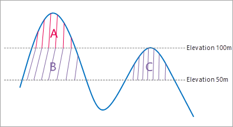

### Introduction

Calculates the surface volume between a 3D curved surface simulated by grid data within polygons and a base plane.

You need to specify a **height datum** as the elevation of datum plane. As follows, given the height datum 50 meter, the measured result contains the volumes of the three areas A, B, C which are enclosed by the datum plane and raster data. However, if the height datum is set as 100 meter, only the volume of the area A will be measured.

  
 
  
### Basic Steps

**Surface Volume**

  1. Open the raster dataset to calculate surface volume. Note that this functionality is enable only when there is raster data opened in the current workspace.
  2. Click **Spatial Analysis** > **Raster Analysis** > **Surface Analysis** > **Surface Volume**.
  3. Draw a polygon on the map, then right click, and then the Surface Volume Parameter Settings dialog box appears. Enter a vertical datum. The default value of Height Datum is the minimum elevation in the specified areas. 
  4. Click "Calculate" button to begin to calculate the volume of the area drawn. The result will be output in the Output window. The default unit of volume is cubic metre. Press Esc key to clear all polygons you have drawn.

**Select polygons**

  1. Click **Spatial Analysis** > **Raster Analysis** > **Surface Analysis** > **Select Polygon Volume**. Or you can select one or more polygons first, then click the Select Polygon Volume to open the Surface Volume Parameter Settings dialog box.
  2. In the Surface Volume Parameter Settings dialog box, enter the datum elevation. When the elevation you specify is larger than the maximum elevation in the current measurement scope, a prompt will appear.
  3. Click "Calculate" button to begin to calculate the volume of raster data convered by the polygons. The result will be output in the Output Window. The default unit of volume is cubic meter. 

Note: When there are more than one polygons selected, the result value will be the sum of all the polygons. The default volume unit is cubic meter. You can press the Esc key to clear the selected state of the polygon(s) in the map window.

