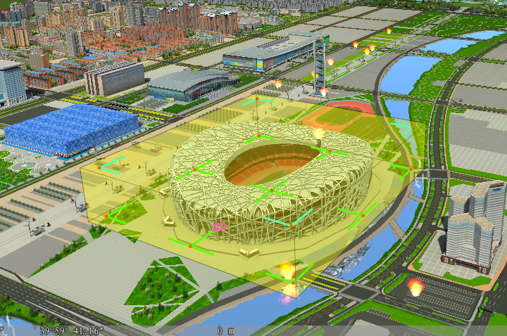
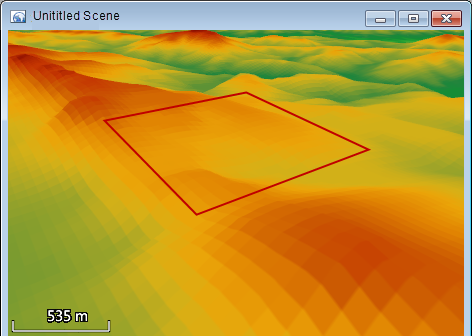

### Introduction

  * The underside of the bounding box of the CAD model is a rectangle, so it is often inconsistent with the model coverage, containing some transparent areas. As shown in the following figure 1, the terrain covered by the bounding box of the model is larger than the scope of actual coverage. The terrain will be matching in accordance with the scope of the bounding box of the model, which could lead to undesirable terrain. So, try to choose the bounding box of the model being consistent with the CAD model data, or the bottom of the model conduct model matching.
  * When the terrain data uses the geographic coordinate system, the application will converse the latitude and longitude into meter, which may influence the precision. Therefore, it is recommended that users use the terrain data with projected coordinate system to match. Then projection transform for the results, which is easy to be viewed in the scene. 
  

  * When the CAD model or regions intersect with each other, the terrain model match may not be correct. So it is best to use the data without intersect objects in the terrain matching.

### Functional Entrances

  * Click the **Spatial Analysis** > **Raster Analysis** > **Build DEM** > **Match Terrain**. 
  * **Toolbox** > **Raster Analysis** > **Build DEM** > **Match Terrain**. (iDesktopX)

### Main Parameters

  * Set the terrain data. 
    * Datasource: List all the datasources in current workspace and select the datasource that the matching terrain dataset belong to.
    * Raster Dataset: List all the grid datasets (GRID) in the current datasource. Select the grid dataset to operate in the list. Here it will locate to the selected terrain datasets in the workspace manager.
  * Set the model data. 
    * Datasource: List all the datasources in current workspace and select the datasource that the matching terrain dataset belong to.
    * Reference Dataset: List all the CAD datasets and region datasets in the current datasource.
  * Set the altitude field. When the reference dataset is the region dataset, it needs to specify the elevation field and take it as the reference to handle the terrain data. When the reference dataset is the CAD model dataset, the elevation field is unavailable.
  * Set the smooth transition parameter. 
    * Radius of transition region: The radius of region that needs to be operated. The range of this region starts from the outer boundary corresponded to the model, and the radius of transition region is the buffer radius. The unit is meter
    * Smooth Factor: The smooth factor determines the smooth effects. When the value is in [0,3], the transition effect is more ideal. When the smooth coefficient is 0, the smoothing operation won't be performed. The default is 2.
  * Set the result data. 
    * Datasource: List all the datasources in current workspace and select the datasource that the result dataset belongs to.
    * Dataset: Input the name of the result dataset.
  * Click "OK" button to execute the operation.

The figure 3 and figure 4 display the 3D display effects of the terrain transition region before and after terrain model matching.

 

### Related Topics

[Overview of Terrain Model Matching](AboutTerrainMatch)

