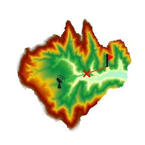

### Instructions

Analyzes whether the observer location and target location are visible to each other on the input surface.

  * Visibility analysis can be applied only when a Grid/DEM dataset exists in the current map window.
  * Added altitude is a component of the total altitude of an observer point. It has important impact on the visibility analysis result. Thus it is important to know about the surface altitude at the observer point and the added altitude in order to make the analysis result more realistic.

**Sample Application**

Open the datasource Terrain in the folder ExerciseData/RasterAnalysis. The datasource includes DEM data with the resolution of 5 meter.

### Functional Entrances

  * Click the **Spatial Analysis** > **Raster Analysis** > **Surface Analysis** > **2-Point Visibility**. 

### Basic Steps

  * Specify observation points. Draw a line segment in the map window. The endpoints of the line segment will serve as the two points for visibility analysis. The line segment will be highlighted in the map window once the drawing is completed.
  * The "2-Point Visibility Analysis" dialog box will pop up as shown below. The coordinate information of the observer point and the observer point is displayed in the dialog box. Input the added altitude of the observer point in the dialog box when applicable.
  * Click the "OK" button to implement the 2-point visibility analysis operation. 
  

After a 2-point visibility analysis is completed, the analysis result will be displayed in the map window and output window. In the map window, a red line indicates that they are not visible to each other, and a green line indicates otherwise. The visibility analysis result will be shown in the output window to indicate whether the two points are visible or invisible to each other. If they are invisible, the user will be given the coordinates of the first obstruction point and a suggestion on the altered altitude.

### Related Topics

 [About Surface Analyst](AoubtSurfaceAnalyst)
