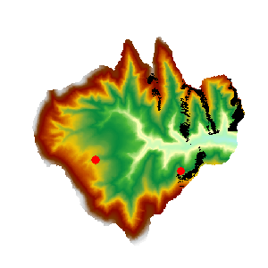

### Instructions

A viewshed analysis is a process of extracting areas that can be seen from one or more observer points with relative altitude(s), given an observation distance and direction, on a grid data surface and outputting the analysis result as a grid dataset.

  * Added altitude is a component of the total altitude of an observer point. It has important impact on the viswshed analysis result. Thus it is important to know about the surface altitude at the observer point(s) and the added altitude(s) in order to make the analysis result more realistic.
  * The default view radius is 0, indicating that visible areas are to be searched for in the entire analysis extent. The unit of the view radius is the same as that of the grid dataset in the analysis.
  * When there are multiple observer points, the result of a viewshed analysis can be the union or intersection of the viewsheds of all the observer points. When "common viewshed" is selected, the intersection of the viewsheds of all the observer points will be adopted; otherwise the union of the viewsheds of all the observer points will be used.

**Sample Application**

Open the datasource Terrain in the folder ExerciseData/RasterAnalysis. The datasource includes DEM data with the resolution of 5 meter.

### Functional Entrances

  * Click the **Spatial Analysis** > **Raster Analysis** > **Surface Analysis** > **Viewshed**. 
  * **Toolbox** > **Raster Analysis** > **Surface Analysis** > **Viewshed** > **Viewshed**. (iDesktopX)

### Main Parameters

  * Specify the observer points. They can be added by clicking the mouse, or by directly importing a point dataset. Or you can click the Import button in the toolbar to import the observation point.

  * The **Import** button is used to import the points of the point dataset as the observation points and observed points to analyze. The dataset must include Append field, View Radius, Start Angle and View Angle. Click Import button and show up the Import dialog box. Set the related parameters in the dialog box.
  * The **Export** button exports the points added in the current map window as point datasets, save the Append, View Radius, Start Angle and View Angle information into the attribute table. Click Export, and the Export dialog box is displayed. You can set the related information in the dialog.
  * **Set** button: When one or more records are selected in the dialog box, click the button to pop up the Batch Parameter Settings dialog box to set the the selected record parameter information, including the values of Append, View Radius, Start Angle and View Angle.
* Set the viewshed analysis parameters, including Added Altitude, View Radius, Start Angle, and View Angle.

**Added Altitude:** The relative altitude above the surface at an observer point. For example, if the actual surface altitude at the observer point is 430 m and the added altitude is 100 m, the altitude of the point would be 530 m. The default value is 0.

**View Radius:** It is for setting the distance limit for a viewshed analysis. The viewshed will be generated within a circle with this value as the radius and centered at the observer point. The default value is 0, indicating that the maximum extent of the surface dataset will be used.

**Start Angle and View Angle** They are for setting the direction limit for a viewshed analysis. The start angle is 0 degree, representing the north direction. Then the search begins from 0 degree and goes anti-clockwise until it reaches the maximum view angle which is 360 degrees by default.

  * Other analysis parameters to be set include analysis result parameters, common viewshed, and whether to add the result dataset to the current map window.

**Datasource:** All the datasources in the current workspace are listed. The datasource containing the dataset to be analyzed is selected here.

**Dataset:** Set the dataset for saving the result. The name of the dataset for saving the result needs to be input.

**Common Viewshed:** When there are multiple observer points, the result of a viewshed analysis can be the union or intersection of the viewsheds of all the observer points. If "Common viewshed" is checked, the intersection of the viewsheds of all the observer points will be adopted; otherwise the union will be used.

**Add result to current map:** If this option is checked, the result dataset will be automatically added to the current map window after the analysis is completed; otherwise it will not be automatically added.

**Close when finished:** If this option is checked, the Viewshed Analysis dialog box will be closed automatically once the analysis is finished; otherwise it will not be closed automatically.

  * Click the "OK" button to implement the viewshed analysis operation.
  
---  
Figure: The Result of Viewshed Analysis

### Related Topics

 [About Surface Analyst](AoubtSurfaceAnalyst)

