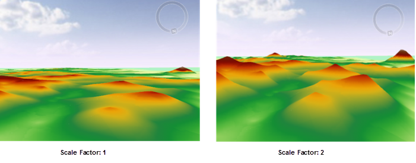

### Source Data

- **Datasource:** Select the datasource that contains the dataset for interpolation.

- **Dataset:** Select the dataset for interpolation. The system will automatically filter the datasets and pick out the line datasets contained in the selected datasource, according to the type of the data for the interpolation analysis. If the interpolation is to be performed on point data, only the point datasets under the corresponding datasource will be displayed.

- **Field:** Select related fields for the interpolation. Non-numeric fields will be filtered out automatically. If the objective of the interpolation is to predict elevation values, this field should be an elevation field; if the objective is to predict precipitation, this field should be a precipitation-related field; if the objective is to predict noise levels, this field should be a noise decibel field. Thus before an interpolation analysis, one must make sure that the selected point dataset have a related field.

- **Scaling Factor:** Multiplying the interpolation field by this value and performing the corresponding interpolation method can enlarge or reduce interpolation values. As the following pictures show, the scaling factor of the left one is 1, while the scaling factor of the right one is 2.

  

### Result Data

- **Datasource:** Select the datasource for saving the spline interpolation analysis result here.

- **Dataset:** Input the name of the dataset for saving the interpolation analysis result here. If the dataset with the input name already exists, the user will be prompted that the name was illegal and a new input is needed.

- **Resolution:** Input the resolution of the interpolation analysis result, i.e., the area of the real region represented by each cell. The unit is the same as the dataset unit. A resolution value can be directly input and then the system will automatically calculate the row number and column number according to the input resolution.

- **Format:** The storage format of cells in the interpolation dataset. Options include: 1-bit no sign, 16-bit integer, 32-bit integer, single precision, and double precision.

- **Columns:** It represents the count of grid columns calculated according to the extent of the grid and the cell height (the latitude difference in each cell).

- **Rows:** It represents the count of grid rows calculated according to the extent of the grid and the cell width (or the longitude difference in each cell).

### Bounds

The extent of the dataset is used by default. SuperMap provides the following three settings:

* **Dataset Bounds** : Click to select the "Dataset Bounds" radio box to set the dataset bounds to the analysis bounds.
* The right drop-down button provides the following two ways: 
    * **Select Object** : It means you can select one or more objects in the current map window through the mouse box or click, the selected object range is set to the output range.
    * **Draw Bounds** : it means you can draw in the current map window by clicking the mouse to determine a rectangular area for the output range.
* **Copy and Paste** : Click the Copy button to copy the currently set range, click the Paste button at the list of supported patches, the left, down, right and top values are set to the current range.

### Environment Settings
* Click "Environment Settings" button to open the "Environment Setting for Raster Analysis" where you can set the analysis parameters to values as needed. For detail operations, please refer to [Setting the Analysis Environment](../../Raster/AnalystEnvironment). 

Note: you are allowed to specify the environment parameters as global variables, then you do not need to set the parameters again in other operations. Also the system can read parameter values specified in the raster analysis environment if you do not set parameters here.
