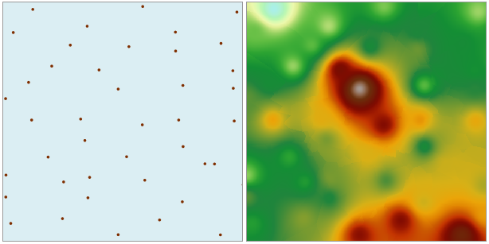

### Instructions

Inverse Distance Weighted (IDW) estimates the value of a cell using the weighted average of sample points around that cell based on the similarity between the points within the region. A surface is then generated.

* There must be a numeric field in the source dataset so that an interpolation field is available.
* IDW interpolation method is a relatively accurate method. It is suitable for sample points with a distribution that is uniform and dense enough to reflect local variations.
* IDW interpolation uses the weighted average of sample points, and an average value cannot be greater than the maximum input value or less than the minimum input value. Therefore in the generated result dataset, every cell has a value within the range defined by the maximum and minimum value in the sample data.
* If the maximum value (e.g., the peak elevation of a certain mountain) is Not applicable tod in the known measurements, the obtained interpolated value at the location where the maximum value is supposed to be will be lower than the values at neighboring points, and this may not be true. Therefore it is recommended that the maximum value and the minimum value of the interpolation region are included in the sample point dataset.

Open the "precipitation" datasource in the folder "SampleData/ExerciseData/RasterAnalysis", there are precipitation data for some regional meteorological monitoring sites, we use the data as an example.

**Function Entrance**

* Click **Spatial Analysis** > **Raster Analysis** > **Interpolation** > **Inverse Distance Weight**.
* **Toolbox** > **Raster Analysis** > **Interpolation** > **IDW**. (iDesktopX) 

### Parameter Description

* Set the common parameters for interpolation analyses, including the source data, the interpolation bounds,the result data and environment settings. For details about setting the source data, the interpolation bounds, and the result data, please see: [Description of common parameters for interpolation](CommonPara).
* Set the mode to search for sample points. There are two modes: Fixed Count and Fixed Radius. For details about these two modes, please see: [Description of common parameters for interpolation](aboutinterpolation).

  - **Fixed Count** : it indicates that a fixed number of sample points within the maximum radius extent will be used for interpolation.
    * **Max Radius** : input the radius for the Fixed Count search. The default value is 0, indicating that the maximum radius is used.
    * **Point Count** : input the point count for the Fixed Count search. The default value is 12.

  - **Fixed Radius** : it indicates that all the sample points within the search radius extent will be used for interpolation
    * **Search Radius** : input the size of the search radius. The default value is 1/5 of the greater value between the length and width of the extent of the dataset in the interpolation. All the sample points within this radius extent will be used in the interpolation.
    * **Minimum Points** : input the minimum count of points for the Fixed Radius search. The default value is 5. When the point count in the neighboring area is less than the specified minimum value, the search radius will increase until it contains the minimum number of points. The maximum value is 12.
* **Power** : Power is the exponent of the weighted distance. It controls the weights of neighboring points during an interpolation. It can be any value greater than 0. An optimal power would be between 0.5 and 3. The default value is 2.
  
