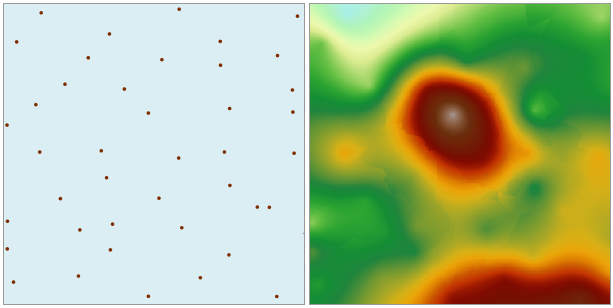

### Instructions

The ordinary Kriging method is the most commonly-used Kriging method. It assumes that the expected value (mean) of the interpolation field is an unknown constant.

* The assumption is that the data used in the ordinary Kriging method have a normal distribution.
* The most unique characteristic of ordinary Kriging is that it not only provides estimations with the minimum error, but also predicts the error amounts.
* For the Kriging interpolation method, there are two ways to determine sample points for estimating the value at a specific point. One way is to use all the sample points within a specific extent around the point to be estimated; the other way is to use a specific number of sample points around the point to be estimated. The value at the point is then estimated using a specific interpolation equation. 

Open the "Precipitation" datasource in the folder "/ExerciseData/RasterAnalysis", there are precipitation data for some regional meteorological monitoring sites, we use the data as an example.

**Function Entrance**

* Click **Spatial Analysis** > **Raster Analysis** > **Interpolation** > **Ordinary Kriging**.
* **Toolbox** > **Raster Analysis** > **Interpolation** > **Ordinary Kriging**. (iDesktopX) 

### Parameter Specification

* Set the common parameters for interpolation analyses, including the source data, the interpolation bonds, the result data and environment settings. For details about setting the source data, the interpolation bounds, and the result data, please see: [Description of common parameters for interpolation](CommonPara).
* Set the mode to search for sample points. There are three supported modes: Fixed Count, Fixed Radius, and Block. For details about these three modes, please see: [Introduction to interpolation](aboutinterpolation).
  - **Fixed Count** : it indicates that a fixed number of sample points within the maximum radius extent will be used for interpolation.
     * **Max Radius** : input the radius for the Fixed Count search. The default value is 0, indicating that the maximum radius is used.
     * **Point Count** : input the point count for the Fixed Count search. The default value is 12.
  - **Fixed Radius** : it indicates that all the sample points within the search radius extent will be used for interpolation.
     * **Search Radius** : input the size of the search radius. The default value is 1/5 of the greater value between the length and width of the extent of the dataset in the interpolation. All the sample points within this radius extent will be used in the interpolation.
     * **Minimum Points** : input the minimum count of points for the Fixed Radius search. The default value is 5. When the point count in the neighboring area is less than the specified minimum value, the search radius will increase until it contains the minimum number of points. The maximum value is 12.
  - **Block** : The dataset is divided into blocks according to the specified maximum point count in each block. The value of an un-sampled point is then estimated through interpolation using the points in the corresponding block.
     * **Most Involved** : input the maximum count of points participating in the interpolation. The default value is 200. To avoid gaps in the interpolation result, the blocks will expand evenly outward during the real calculation process. "Most Involved" determines the expansion size of the blocks. Usually this value should be greater than the specified "Most in Block".
     * **Most in Block** : input the maximum count of points in each block. The default value is 50. If the point count in a block is greater than this value, this block is divided again; otherwise the division is stopped. The values of "Most Involved" and "Most in Block" will directly affect the performance of Block searching. The greater these two values are, the longer the searching will take. Thus it is recommended that reasonable parameters are set for Block searching.

* **Other parameters**: includes Semivariogram, Rotation, Mean, Sill, Range, and Nugget Effect.

  - **Semivariogram** : Click the drop-down arrow to the right of "Semivariogram" and select a function type. SuperMap supports the Spherical type, the Exponential type, and the Gaussian type. Which model to choose depends on the spatial autocorrelation of the data and the prior knowledge about the phenomenon. Spherical function is used by default.

  - **Rotation** : The anti-clockwise angle of each searching neighborhood relative to the horizontal direction. The default is 0 degree. This parameter is not applicable to Block searching.

  - **Sill** : Sill is the top value of the semivariogram, i.e., the value at the intersection of the semivariogram and the Y axis when the distance (the value on the X axis) is 0. The default value is 0.

  - **Range** : The distance (the value on the X axis) at which the semivariogram reaches the Sill. The default value is 0.

  - **Nugget Effect** : The value at the intersection of the semivariogram and the Y axis when h=0 (the X axis). The default value is 0.

For relationships between Sill, Range, and Nugget Effect, please see: [Kriging](aboutinterpolation).

  
